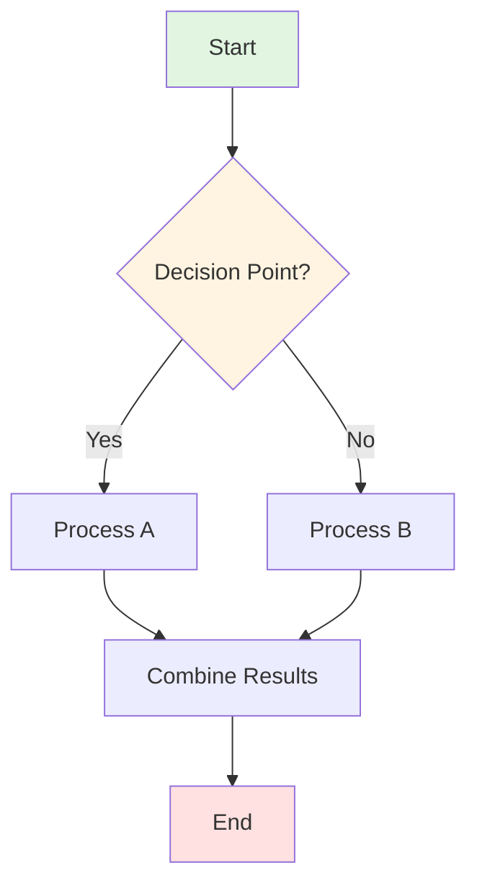
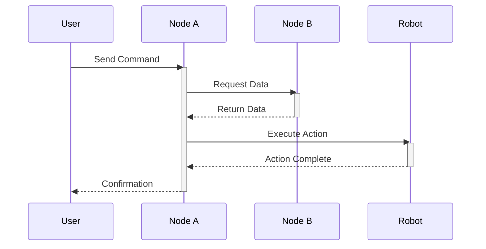
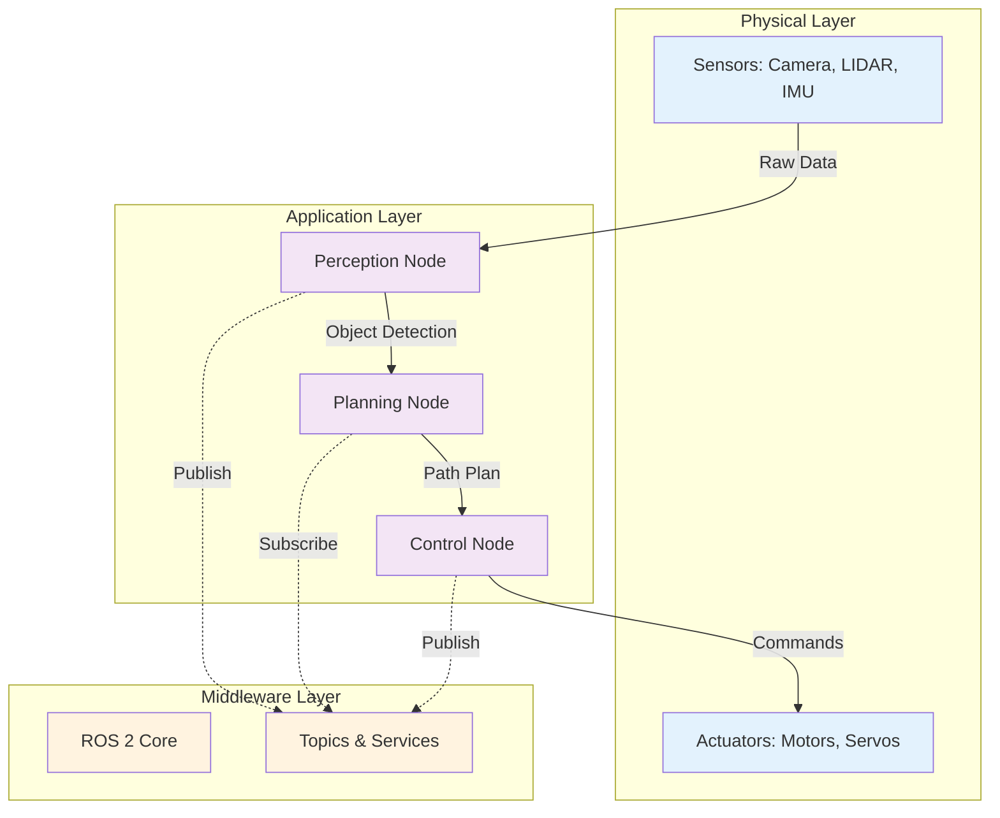
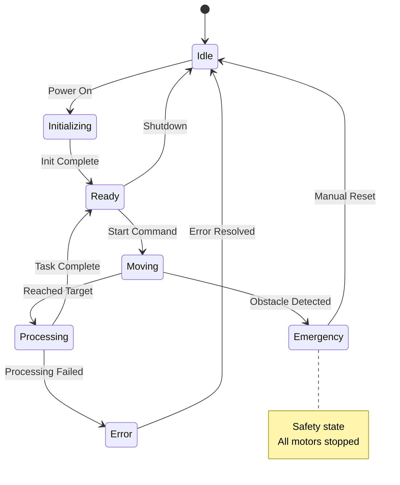
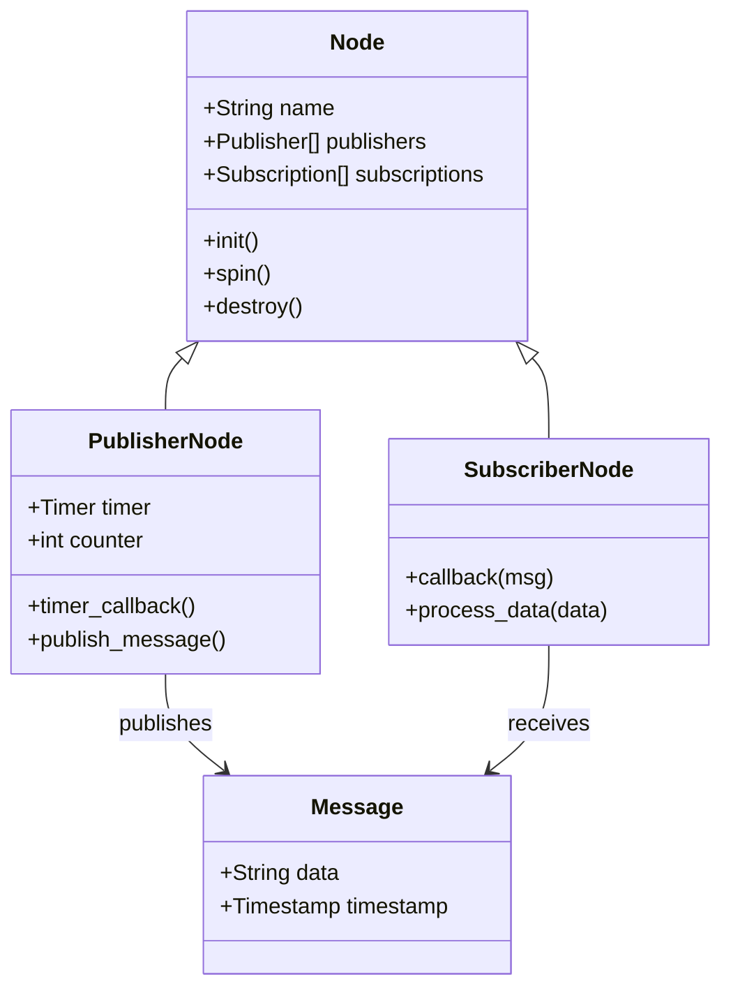
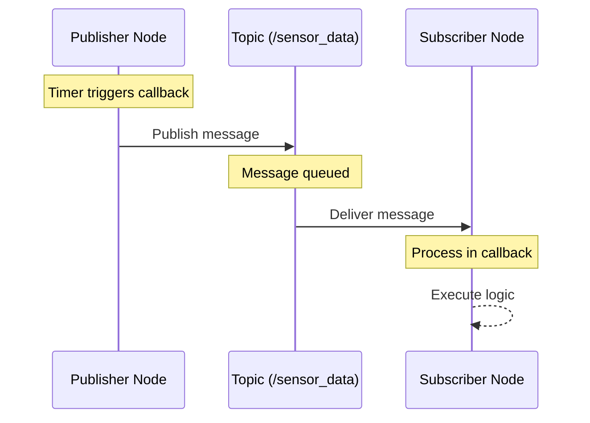
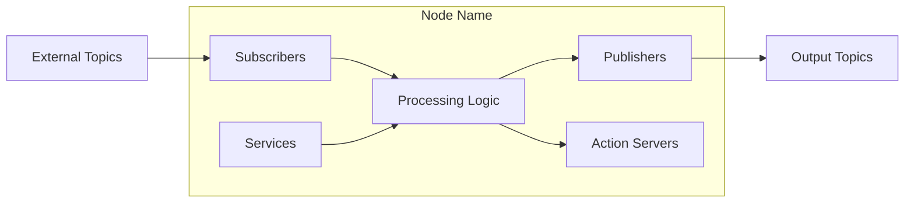
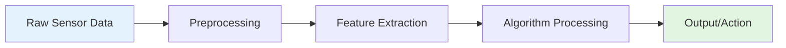
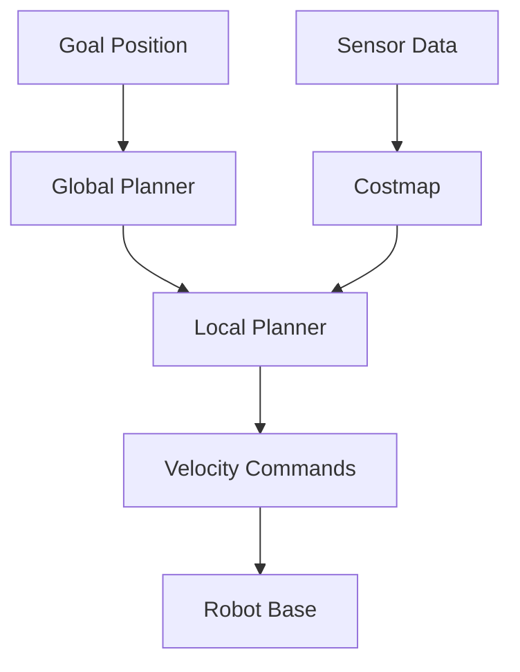
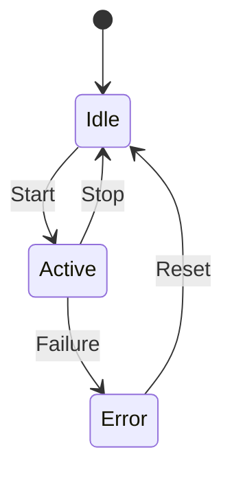

# Skill: Generate Mermaid Diagrams

## Purpose
Creates clear, professional Mermaid diagrams for visualizing Physical AI concepts, system architectures, data flows, and processes. All diagrams must be rendered in Docusaurus using Mermaid syntax.

## Capabilities
- Generate flowcharts for processes and algorithms
- Create sequence diagrams for component interactions
- Build architecture diagrams for system components
- Design state diagrams for robot states
- Make class diagrams for software structure

## Input Parameters

When using this skill, provide:

1. **diagram_type**: String ("flowchart", "sequence", "architecture", "state", "class")
2. **concept**: String (what to visualize - e.g., "ROS 2 message flow")
3. **components**: Array of component names to include
4. **complexity**: String ("simple", "detailed")
5. **title**: String (diagram title/caption)

## Mermaid Syntax Reference

### Flowchart (Process Flow)

**Use for:** Algorithms, decision trees, process flows, pipelines



**Basic Shapes:**
- `[Rectangle]` - Process/Step
- `{Diamond}` - Decision
- `([Rounded])` - Start/End
- `[[Subroutine]]` - Sub-process
- `[(Database)]` - Storage
- `((Circle))` - Connection point

**Arrows:**
- `-->` - Solid arrow
- `-.->` - Dotted arrow
- `==>` - Thick arrow
- `--text-->` - Labeled arrow

### Sequence Diagram (Interactions)

**Use for:** Node communication, API calls, message passing, time-based interactions



**Interactions:**
- `->>` - Solid line message
- `-->>` - Dashed line response
- `-x` - Lost message
- `activate/deactivate` - Show active period

### Architecture Diagram (System Components)

**Use for:** System overview, component relationships, data flow



**Subgraphs:**
- Group related components
- Show layers or modules
- Use descriptive names

### State Diagram (Robot States)

**Use for:** Robot state machines, mode transitions, error handling



**States:**
- `[*]` - Initial/final state
- `State --> State` - Transition
- `note` - Add explanations

### Class Diagram (Software Structure)

**Use for:** Code architecture, inheritance, relationships



## Standard Color Scheme

Use consistent colors for clarity:

```
- Blue (#e3f2fd): Hardware/Physical components
- Orange (#fff3e0): Middleware/Communication
- Purple (#f3e5f5): Application/Software
- Green (#e1f5e1): Success/Start states
- Red (#ffe1e1): Error/End states
- Yellow (#fff4e1): Warning/Decision points
- Gray (#f5f5f5): Inactive/Background
```

## Output Format

Every diagram must include:

1. **Context Paragraph** (before diagram): Explain what the diagram shows
2. **Mermaid Code Block**: Complete, valid Mermaid syntax
3. **Caption** (after diagram): Title and brief description
4. **Explanation** (after diagram): Detailed walkthrough of components

## Example Output Structure

````markdown
### ROS 2 Publisher-Subscriber Communication

Understanding how nodes communicate is fundamental to ROS 2. The following diagram illustrates the message flow between a publisher node and subscriber node through a topic.



**Figure 1:** ROS 2 Publisher-Subscriber Communication Pattern

**Explanation:**

This sequence diagram shows the asynchronous communication pattern in ROS 2:

1. **Publisher Node**: A timer triggers the callback function, which creates and publishes a message
2. **Topic**: Acts as a message broker, queuing messages for delivery
3. **Subscriber Node**: Receives the message and processes it in its callback function
4. **Asynchronous**: The publisher doesn't wait for subscribers - it publishes and continues

**Key Points:**
- Communication is one-way (publisher → subscriber)
- Topics can have multiple publishers and subscribers
- Messages are queued if subscribers are slow
- No direct connection between nodes - only through topics

**When to Use This Pattern:**
- Sensor data broadcasting
- State information sharing
- One-to-many communication
- Fire-and-forget messaging
````

## Diagram Complexity Guidelines

### Simple Diagrams
- 3-5 components/nodes
- Single layer or flow
- Clear, focused concept
- Minimal text labels

### Detailed Diagrams
- 6-15 components/nodes
- Multiple layers or subgraphs
- Complete system view
- Descriptive labels and notes

## Common Diagram Templates

### Template 1: ROS 2 Node Architecture


### Template 2: Sensor Pipeline


### Template 3: Navigation Stack


### Template 4: State Machine


## Best Practices

1. **Keep It Focused**: One concept per diagram
2. **Use Consistent Naming**: Match code and text references
3. **Add Legends**: Explain colors and symbols if not obvious
4. **Label Everything**: All nodes and edges should be labeled
5. **Direction Matters**: Left-to-right or top-to-bottom flow
6. **Highlight Critical Paths**: Use colors or thick lines
7. **Add Notes**: For complex sections, add explanatory notes
8. **Test Rendering**: Verify diagram displays correctly in Docusaurus

## Quality Checklist

Before finalizing any diagram:

- [ ] Valid Mermaid syntax (renders without errors)
- [ ] All components labeled clearly
- [ ] Consistent color scheme used
- [ ] Arrows show correct direction
- [ ] Context paragraph provided
- [ ] Caption/title included
- [ ] Detailed explanation written
- [ ] Appropriate complexity level
- [ ] Matches chapter content
- [ ] Mobile-friendly (not too wide)

## Troubleshooting

### Diagram Not Rendering
- Check Mermaid syntax validity
- Verify Docusaurus has `@docusaurus/theme-mermaid` plugin
- Ensure code block uses ```mermaid not ```markdown

### Diagram Too Complex
- Split into multiple simpler diagrams
- Use subgraphs to organize
- Focus on one aspect at a time

### Colors Not Showing
- Use `style` command: `style A fill:#color`
- Check color hex codes are valid

## Integration with Other Skills

This skill works with:
- **chapter-structure**: Diagrams go in architecture sections
- **code-example**: Visualize code structure and flow
- **content-writer**: Support text explanations with visuals