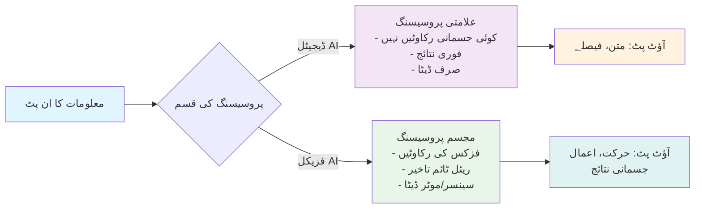
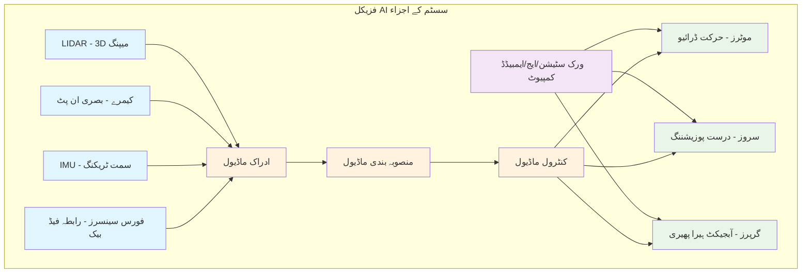

# مجسم ذہانت کا آغاز

> **مشکل کی سطح**: 🟢 ابتدائی (سطح 1)
> **پڑھنے کا وقت**: 20-25 منٹ
> **پیشگی ضروریات**: کوئی نہیں - یہ آپ کا نقطہ آغاز ہے!

## تعارف

تصور کریں کہ آپ اپنے روبوٹ اسسٹنٹ کو حکم دیتے ہیں "اوپر کی شیلف سے سرخ کتاب لا دو،" اور دیکھتے ہیں کہ یہ خوبصورتی سے فرنیچر کے گرد گھومتا ہے، اپنے بصری سینسرز کے ذریعے صحیح کتاب کی شناخت کرتا ہے، اور احتیاط سے اسے اٹھا کر لاتا ہے—بالکل جیسا آپ نے سوچا تھا۔ یہ منظر مجسم ذہانت کی قابل ذکر صلاحیت کی نمائندگی کرتا ہے، جہاں مصنوعی ذہانت ڈیجیٹل دائرے سے آگے بڑھ کر حقیقی دنیا کے ساتھ بامعنی تعامل کرتی ہے۔

کئی دہائیوں سے، مصنوعی ذہانت بنیادی طور پر ڈیجیٹل جگہوں میں موجود رہی ہے—ڈیٹا کا تجزیہ کرنا، زبان پر کارروائی کرنا، اور کسی جسمانی موجودگی کے بغیر پیشگوئیاں کرنا۔ اس صرف ڈیجیٹل AI نے متاثر کن سنگ میل حاصل کیے ہیں، پیچیدہ کھیلوں میں عالمی چیمپئنز کو شکست دینے سے لے کر انسان جیسا متن تیار کرنے تک۔ تاہم، اب ہم ایک تبدیلی کے لمحے پر کھڑے ہیں جہاں AI سسٹمز جسم حاصل کر رہے ہیں اور حقیقی دنیا کے ساتھ بامعنی طریقوں سے تعامل کرنا سیکھ رہے ہیں۔ فزیکل AI، یا مجسم ذہانت کی طرف یہ تبدیلی مشینوں کے لیے ہماری دنیا کو سمجھنے اور اس کے ساتھ بنیادی طور پر انسان جیسے طریقوں سے تعامل کرنے کے بے مثال امکانات کھولتی ہے۔

مجسم ذہانت ایک پیراڈائم کی نمائندگی کرتی ہے جہاں AI سسٹمز نہ صرف ڈیٹا سے سیکھتے ہیں، بلکہ اپنے ماحول کے ساتھ براہ راست تعامل کے ذریعے۔ روایتی AI کے برعکس جو معلومات پر تنہائی میں کارروائی کرتی ہے، مجسم نظام حسی-حرکی تجربات کے ذریعے سمجھ پیدا کرتے ہیں—چھونا، حرکت کرنا، تلاش کرنا، اور حقیقی دنیا کی فزکس اور رکاوٹوں کے مطابق ڈھلنا۔

اس باب میں، آپ مجسم ذہانت کی تین بنیادی ستونوں کے بارے میں سیکھیں گے: ادراک کے نظام جو روبوٹس کو اپنے ماحول کو محسوس کرنے اور سمجھنے کی اجازت دیتے ہیں، کنٹرول میکانزم جو مقصدی حرکت اور تعامل کو ممکن بناتے ہیں، اور سیکھنے کے الگورتھم جو فزیکل AI سسٹمز کو تجربے کے ذریعے ڈھلنے اور بہتر ہونے دیتے ہیں۔ آپ دریافت کریں گے کہ یہ عناصر کیسے مل کر ایسی مشینیں بناتے ہیں جو نہ صرف سوچتی ہیں، بلکہ حقیقی دنیا میں عمل کرتے ہوئے سوچتی ہیں۔

## ڈیجیٹل AI بمقابلہ فزیکل AI

ڈیجیٹل AI اور فزیکل AI کے درمیان فرق کو سمجھنا مجسم ذہانت میں آپ کے سفر کی بنیاد بناتا ہے۔ آپ دریافت کریں گے کہ مصنوعی ذہانت کے یہ دو طریقے اپنے ارد گرد کی دنیا کے ساتھ تعامل میں بنیادی طور پر کیسے مختلف ہیں۔

ڈیجیٹل AI، جیسا کہ آپ پہلے سے جانتے ہوں گے، مکمل طور پر ورچوئل جگہوں اور ڈیٹا ڈومینز میں کام کرتی ہے۔ ChatGPT جیسے سسٹمز کے بارے میں سوچیں جو بغیر کسی جسمانی شکل کے انسانی زبان پر کارروائی اور تیار کرتے ہیں، یا تصویری شناخت کے الگورتھم جو تصاویر میں اشیاء کی شناخت کرتے ہیں بغیر انہیں چھوئے۔ یہ سسٹمز پیٹرن ریکگنیشن، ڈیٹا تجزیہ، اور معلومات کی پروسیسنگ میں ماہر ہیں—یہ اس میں رہتے ہیں جسے ہم "جار میں دماغ" کہہ سکتے ہیں، جہاں وہ جسمانی حقیقت کی رکاوٹوں کے بغیر علامات اور ڈیٹا کو ہیرا پھیری کرتے ہیں۔

فزیکل AI، جسے مجسم ذہانت بھی کہا جاتا ہے، مصنوعی ذہانت کو ٹھوس دنیا میں پھیلاتی ہے۔ Tesla کے Optimus ہیومنائیڈ روبوٹ یا Boston Dynamics کے Atlas جیسے سسٹمز ظاہر کرتے ہیں کہ AI کیسے تین جہتی جگہ میں جسمانی اشیاء کو سمجھ سکتی ہے، حرکت کر سکتی ہے، اور ان کے ساتھ تعامل کر سکتی ہے۔ ان سسٹمز کو کشش ثقل، رگڑ، مومینٹم، اور بے شمار حقیقی دنیا کے متغیرات سے نمٹنا ہوتا ہے جن کا ڈیجیٹل AI کو کبھی سامنا نہیں ہوتا۔

```python
# مثال: ڈیجیٹل AI بمقابلہ فزیکل AI پروسیسنگ
class DigitalAI:
    def process_input(self, text):
        # جسمانی رکاوٹوں کے بغیر معلومات پر کارروائی
        return self.analyze_text(text)

    def analyze_text(self, text):
        # خالص ڈیٹا پروسیسنگ
        return f"تجزیہ: {text}"

class PhysicalAI:
    def process_input(self, sensor_data):
        # جسمانی رکاوٹوں اور ریئل ٹائم پروسیسنگ کا حساب رکھنا ضروری
        perception = self.perceive_environment(sensor_data)
        action = self.plan_movement(perception)
        return self.execute_action(action)

    def perceive_environment(self, data):
        # جسمانی سیاق و سباق کے ساتھ سینسر ڈیٹا کی تشریح
        return {"objects": [], "obstacles": [], "targets": []}

    def plan_movement(self, perception):
        # فزکس، توازن، اور میکینیکل رکاوٹوں کا حساب
        return {"movement": "آگے", "speed": 0.5}

    def execute_action(self, action):
        # حقیقی نتائج کے ساتھ جسمانی جگہ میں عملدرآمد
        return f"حرکت: {action['movement']} رفتار {action['speed']} پر"
```

یہ کوڈ مثال ظاہر کرتی ہے کہ ڈیجیٹل AI کیسے خالص علامتی طریقے سے معلومات پر کارروائی کر سکتی ہے، جبکہ فزیکل AI کو ریئل ٹائم سینسر پروسیسنگ، حرکت کی منصوبہ بندی، اور جسمانی دنیا میں عملدرآمد کا حساب رکھنا ضروری ہے۔



### مشق: AI سسٹمز کی درجہ بندی

ڈیجیٹل اور فزیکل AI کے درمیان فرق کی اپنی سمجھ کو مضبوط کرنے کے لیے، درج ذیل سسٹمز کو ڈیجیٹل AI یا فزیکل AI کے طور پر درجہ بند کریں:

1. ایک چیٹ بوٹ جو کسٹمر سروس سوالات کا جواب دیتا ہے
2. ایک خودمختار ڈیلیوری روبوٹ جو شہر کے فٹ پاتھوں پر چلتا ہے
3. ایک کمپیوٹر ویژن سسٹم جو مینوفیکچرنگ لائن پر نقائص کا پتہ لگاتا ہے
4. ایک ہیومنائیڈ روبوٹ جو بزرگ لوگوں کی روزمرہ کاموں میں مدد کرتا ہے
5. ایک سفارش الگورتھم جو سٹریمنگ پلیٹ فارم پر فلمیں تجویز کرتا ہے
6. ایک گودام روبوٹ جو پیکجز اٹھاتا اور ترتیب دیتا ہے

## ہیومنائیڈ روبوٹس کیوں؟

جب آپ فزیکل AI کی دنیا کو تلاش کرتے ہیں، تو آپ دریافت کریں گے کہ ہیومنائیڈ روبوٹس انجینئرنگ اور عملی ضرورت کے ایک دلچسپ تقاطع کی نمائندگی کرتے ہیں۔ قدرتی طور پر سوال اٹھتا ہے: جب ہم مکمل طور پر مختلف ترتیب والی مشینیں بنا سکتے ہیں تو انسان جیسی شکل اور صلاحیتوں والے روبوٹس کیوں بنائیں؟ جواب اس گہری حقیقت میں ہے کہ ہماری دنیا انسانی جسموں اور انسانی تعامل کے نمونوں کے لیے ڈیزائن کی گئی ہے۔

ہماری انسان مرکز دنیا بے شمار affordances پیش کرتی ہے—ماحول کی خصوصیات جو ممکنہ اعمال کی تجویز کرتی ہیں—جو قدرتی طور پر دو ٹانگوں والی مخلوقات کو ایڈجسٹ کرتی ہیں جن کے دو بازو اور مخالف انگوٹھے ہیں۔ سیڑھیوں پر غور کریں، جو انسانی قدم کی لمبائی اور ٹانگوں کی طاقت کے لیے انجینئر کی گئی ہیں۔ دروازے کے ہینڈل، لائٹ سوئچز، اوزار، اور فرنیچر سب انسانی طول و عرض اور ہیرا پھیری کی صلاحیتوں کے لیے بہتر بنائے گئے ہیں۔

ہیومنائیڈ شکل کے فوائد مخصوص صلاحیتوں کا جائزہ لیتے وقت واضح ہو جاتے ہیں:

• **دو ٹانگوں پر چلنا**: انسانی ڈیزائن کردہ جگہوں کی نیویگیشن ممکن بناتا ہے بشمول سیڑھیاں، تنگ دروازے، اور ناہموار زمین
• **دو بازوؤں کی ترتیب**: انسانی ہیرا پھیری کی صلاحیتوں کی عکاسی کرتی ہے
• **انسانی جیسی پہنچ اور مہارت**: انسانی پیمانے کے اعضاء کے تناسب مختلف اونچائیوں پر اشیاء تک پہنچنے میں سہولت فراہم کرتے ہیں
• **سماجی مطابقت**: انسان جیسی ظاہری شکل نفسیاتی رکاوٹوں کو کم کرتی ہے

```python
# مثال: ہیومنائیڈ affordance استعمال
class HumanoidRobot:
    def __init__(self):
        self.height = 1.7  # میٹر - انسانی پیمانہ
        self.arms = 2      # دو بازوؤں کی ترتیب
        self.legs = 2      # دو ٹانگوں پر چلنا

    def navigate_human_environment(self):
        """انسانی ڈیزائن کردہ جگہوں میں ہیومنائیڈ فائدہ کا مظاہرہ"""
        affordances_used = []

        # انسانی ڈیزائن کردہ affordances استعمال کریں
        affordances_used.append(self.use_door_handle())
        affordances_used.append(self.climb_stairs())
        affordances_used.append(self.operate_light_switch())
        affordances_used.append(self.manipulate_tool())

        return affordances_used

    def use_door_handle(self):
        return "انسان نما ہاتھ سے دروازے کا ہینڈل پکڑا"

    def climb_stairs(self):
        return "دو ٹانگوں والی چال سے سیڑھیاں چڑھیں"

    def operate_light_switch(self):
        return "بازو پھیلا کر انسانی اونچائی پر سوئچ دبایا"

    def manipulate_tool(self):
        return "اوزار چلانے کے لیے دو ہاتھوں کی گرفت استعمال کی"

# متبادل روبوٹ ترتیب
class WheeledRobot:
    def climb_stairs(self):
        return "سیڑھیاں نہیں چڑھ سکتا - پہیوں والے ڈیزائن کی حد"

class QuadrupedRobot:
    def operate_light_switch(self):
        return "سوئچ تک نہیں پہنچ سکتا - ہیرا پھیری کرنے والے بازو نہیں"
```

## فزیکل AI سسٹم کے اجزاء

جب آپ فزیکل AI میں گہرائی میں جاتے ہیں، تو آپ دریافت کریں گے کہ ہر مجسم نظام چار ضروری اجزاء پر مشتمل ہوتا ہے جو جسمانی دنیا میں ذہین رویہ پیدا کرنے کے لیے ہم آہنگی سے کام کرتے ہیں۔

پہلا بنیادی جزء **سینسرز** پر مشتمل ہے جو روبوٹ کی آنکھوں، کانوں، اور حسی اعضاء کے طور پر کام کرتے ہیں:
- **LIDAR (Light Detection and Ranging)**: لیزر پلس خارج کرتا ہے اور ماحول کے درست 3D نقشے بنانے کے لیے ان کی واپسی کا وقت ناپتا ہے
- **کیمرے**: 2D یا 3D فارمیٹ میں بصری معلومات حاصل کرتے ہیں
- **IMU (Inertial Measurement Unit)**: روبوٹ کی سمت، ایکسلریشن، اور کونیی رفتار کو ٹریک کرتا ہے
- **فورس سینسرز**: رابطے کی قوتوں اور ٹارکس کو ناپتے ہیں

دوسرا جزء **کمپیوٹ سسٹمز** پر مشتمل ہے:
- **ورک سٹیشن کلاس کمپیوٹنگ**: نیورل نیٹ ورکس کی تربیت جیسے پیچیدہ کاموں کے لیے
- **ایج کمپیوٹنگ**: موبائل روبوٹس کے لیے موزوں کمپیکٹ، توانائی موثر پیکجز
- **ایمبیڈڈ سسٹمز**: موٹر کنٹرول جیسے مخصوص کاموں کے لیے بہتر بنائی گئی پروسیسنگ

تیسرا جزء **ایکچویٹرز** پر مشتمل ہے:
- **موٹرز**: برقی توانائی کو میکینیکل حرکت میں تبدیل کرتی ہیں
- **سروز**: درست پوزیشننگ کنٹرول کے لیے بلٹ ان فیڈ بیک میکانزم
- **گرپرز**: فورس کنٹرول سسٹمز کے ساتھ ہیرا پھیری کی صلاحیتیں فراہم کرتے ہیں

چوتھا جزء **سافٹ ویئر سٹیک** ہے جو پورے سسٹم کو perception → planning → control پائپ لائن کے ذریعے منظم کرتا ہے۔

```python
# مثال: فزیکل AI سسٹم کے اجزاء مل کر کام کرتے ہوئے
class PhysicalAISystem:
    def __init__(self):
        # سینسر اجزاء
        self.lidar = LIDARSensor()
        self.camera = Camera()
        self.imu = IMUSensor()
        self.force_sensors = ForceSensors()

        # کمپیوٹ اجزاء
        self.compute = EdgeComputeSystem()

        # ایکچویٹر اجزاء
        self.motors = MotorArray()
        self.servos = ServoControllers()
        self.gripper = Gripper()

        # سافٹ ویئر سٹیک
        self.perception = PerceptionModule()
        self.planning = PlanningModule()
        self.control = ControlModule()

    def execute_task(self, goal):
        # ادراک: ماحول کو محسوس کرنا
        sensor_data = {
            'lidar_data': self.lidar.scan(),
            'camera_data': self.camera.capture(),
            'imu_data': self.imu.get_orientation(),
            'force_data': self.force_sensors.get_forces()
        }

        # منصوبہ بندی: اعمال کا تعین
        environmental_state = self.perception.process(sensor_data)
        action_plan = self.planning.compute_action(environmental_state, goal)

        # کنٹرول: حرکات پر عملدرآمد
        motor_commands = self.control.generate_commands(action_plan)
        self.motors.execute(motor_commands)

        return "کام کامیابی سے مکمل"
```



## عملدرآمد کا نقطہ نظر

جب آپ فزیکل AI میں اپنا سفر شروع کرتے ہیں، تو آپ دریافت کریں گے کہ چیلنجز روایتی ڈیجیٹل AI سسٹمز سے ڈرامائی طور پر مختلف ہیں۔ ڈیجیٹل AI ایک کنٹرولڈ، ورچوئل ماحول میں کام کرتی ہے جہاں بنیادی توجہ الگورتھمز اور ڈیٹا پروسیسنگ پر مرکوز ہوتی ہے۔

فزیکل AI، تاہم، حقیقی دنیا کی رکاوٹوں کا ایک پیچیدہ جال متعارف کراتی ہے جو عملدرآمد کے منظر نامے کو بنیادی طور پر بدل دیتا ہے۔ آپ کو ریئل ٹائم پروسیسنگ کی ضروریات کا سامنا ہوگا جہاں تاخیر تباہ کن ناکامیوں کا نتیجہ بن سکتی ہے۔ حفاظت سب سے اہم ہو جاتی ہے، جس کے لیے متعدد fail-safes اور redundant سسٹمز کی ضرورت ہوتی ہے۔

فزکس پیچیدگی کی ایک اور تہہ شامل کرتی ہے۔ آپ کو سینسر نوائز سے نمٹنا ہوگا جو ان پٹ ڈیٹا کو خراب کرتی ہے، ہارڈویئر کی ناکامیاں جو بغیر انتباہ کے ہوتی ہیں، اور حقیقی دنیا کے ماحول کی غیر متوقع نوعیت۔

## عام غلط فہمیاں

| غلط فہمی | حقیقت | یہ کیوں اہم ہے |
|----------|-------|----------------|
| فزیکل AI صرف جسم والی ڈیجیٹل AI ہے | فزیکل AI سسٹمز بنیادی طور پر مختلف چیلنجز کا سامنا کرتے ہیں بشمول ریئل ٹائم پروسیسنگ، فزکس کی رکاوٹیں، اور حسی-حرکی انضمام | ان فرقوں کو سمجھنا مجسم سسٹمز کے لیے مناسب الگورتھمز اور سسٹم آرکیٹیکچرز ڈیزائن کرنے کے لیے اہم ہے |
| ڈیجیٹل AI تکنیکیں براہ راست فزیکل AI پر لاگو ہوتی ہیں | فزیکل AI کو غیر یقینی صورتحال، نوائز، تاخیر، اور حفاظتی رکاوٹوں سے نمٹنے کے لیے خصوصی طریقوں کی ضرورت ہے | آپ کو AI الگورتھمز کے اپنے علم کو جسمانی تعامل کی حقیقتوں کے مطابق ڈھالنا ہوگا |
| مجسم سسٹمز فزکس پر غور کیے بغیر کام کر سکتے ہیں | فزیکل AI کو مسلسل کشش ثقل، رگڑ، مومینٹم، اور ماحولیاتی قوتوں کا حساب رکھنا ہوتا ہے | جسمانی قوانین پر غور نہ کرنا غیر مستحکم، غیر محفوظ رویوں کا باعث بنتا ہے |

## حقیقی دنیا کی ایپلیکیشنز

جب آپ فزیکل AI کی بنیادوں کو تلاش کرتے ہیں، تو آپ دریافت کریں گے کہ مجسم ذہانت پہلے سے ہماری دنیا کو بدل رہی ہے۔ Tesla کا Optimus ہیومنائیڈ روبوٹ ظاہر کرتا ہے کہ مشینیں کیسے انسانی ماحول میں گھوم سکتی ہیں، جبکہ Boston Dynamics کا Spot جدید گتی اور ماحولیاتی تعامل کی صلاحیتوں کا مظاہرہ کرتا ہے۔

یہ دور کے مستقبل کے تصورات نہیں ہیں—یہ آج کی حقیقت ہیں۔ صحت کی سہولیات اب مریضوں کی دیکھ بھال کے لیے معاون روبوٹس تعینات کرتی ہیں، آفات سے نمٹنے والی ٹیمیں خطرناک ماحول میں گھومنے کے لیے روبوٹس استعمال کرتی ہیں، اور خلائی ایجنسیاں سیاروں کی تلاش کے مشنز کے لیے مجسم سسٹمز تیار کر رہی ہیں۔

## تصوراتی مشقیں

### مشق 1: منظر نامے کا تجزیہ - ڈیجیٹل AI بمقابلہ فزیکل AI

#### ہدایات
درج ذیل منظرناموں میں سے ہر ایک کو **ڈیجیٹل AI** یا **فزیکل AI** کے طور پر درجہ بند کریں اور اپنا استدلال فراہم کریں۔

**منظر نامہ 1: کسٹمر سروس سوالات کا جواب دینا**
ایک AI سسٹم صارفین سے متن پر مبنی سوالات وصول کرتا ہے اور مناسب حل کے ساتھ جواب دیتا ہے۔

**منظر نامہ 2: اشیاء لانے کے لیے گودام میں نیویگیشن**
ایک خودمختار روبوٹ گودام میں گھومتا ہے، کمپیوٹر ویژن کا استعمال کرتے ہوئے مخصوص مصنوعات کی شناخت کرتا ہے، اور انہیں جسمانی طور پر شپنگ کے لیے لاتا ہے۔

**منظر نامہ 3: مارکیٹنگ کاپی تیار کرنا**
ایک AI ٹول مارکیٹ کے رجحانات اور صارفین کے ڈیٹا کا تجزیہ کرتا ہے تاکہ پرکشش اشتہاری مواد تیار کرے۔

**منظر نامہ 4: فرنیچر اسمبل کرنا**
ایک روبوٹک بازو لمسی سینسرز اور کیمروں سے لیس، فرنیچر کے پرزوں کو جوڑنے کے لیے ہدایات پر عمل کرتا ہے۔

**منظر نامہ 5: دستاویزات کا ترجمہ**
ایک AI سسٹم تحریری متن کو ایک زبان سے دوسری میں تبدیل کرتا ہے۔

### مشق 2: اجزاء کی شناخت - کپ اٹھانا

**کام**: میز سے کپ اٹھانے کے لیے روبوٹ کے لیے درکار اجزاء کا تجزیہ کریں

اپنا مشن مندرجہ ذیل کی شناخت کرنا ہے:
1. اس کام کے لیے درکار سینسرز
2. عمل انجام دینے کے لیے درکار ایکچویٹرز
3. کامیاب عملدرآمد کے لیے منصوبہ بندی کی ضروریات

## اہم نکات

• **آپ سمجھیں گے کہ فزیکل AI مصنوعی ذہانت اور جسمانی نظاموں کے ملاپ کی نمائندگی کرتی ہے**، مشینوں کو سینسرز، ایکچویٹرز، اور مجسم ادراک کے اصولوں کے ذریعے حقیقی دنیا کے ماحول میں سمجھنے، استدلال کرنے، اور عمل کرنے کے قابل بناتی ہے۔

• **آپ پہچانیں گے کہ مجسم ذہانت روایتی AI سسٹمز سے بنیادی طور پر کیسے مختلف ہے** جسمانی تعامل، ماحولیاتی فیڈ بیک، اور ذہین رویے کی تشکیل میں جسم کے کردار پر زور دے کر۔

• **آپ disembodied AI سے مجسم سسٹمز تک تاریخی ارتقاء کی تعریف کریں گے**، ابتدائی علامتی AI طریقوں سے لے کر جدید روبوٹکس تک جو ادراک، ادراک، اور عمل کو متحد فریم ورکس میں ضم کرتی ہے۔

• **آپ روبوٹک سسٹمز میں مجسم ذہانت کو ممکن بنانے والے بنیادی اجزاء کی شناخت کریں گے**، بشمول سینسنگ صلاحیتیں، کمپیوٹیشنل پروسیسنگ، موٹر کنٹرول سسٹمز، اور سیکھنے کے میکانزم۔

• **آپ متنوع ایپلیکیشنز میں فزیکل AI کی تبدیلی کی صلاحیت کو سمجھیں گے**، خودمختار گاڑیوں اور معاون روبوٹکس سے لے کر صنعتی آٹومیشن اور حقیقی دنیا کی ترتیبات میں انسان-روبوٹ تعاون تک۔

## مزید پڑھائی

جب آپ مجسم ذہانت میں اپنا سفر جاری رکھتے ہیں، تو یہ احتیاط سے منتخب کردہ وسائل فزیکل AI تصورات اور ایپلیکیشنز کی آپ کی سمجھ کو گہرا کریں گے۔

**[Embodied Cognition: An Introduction](https://example.com/embodied-cognition-intro)** - یہ جامع وسیلہ مجسم ادراک کی فلسفیانہ اور نظریاتی بنیادوں کو تلاش کرتا ہے۔

**[Robotics: Science and Systems Conference Proceedings](https://example.com/rss-proceedings)** - روبوٹکس اور AI کے تقاطع پر مرکوز اہم روبوٹکس کانفرنس سے جدید ترین تحقیق تک رسائی حاصل کریں۔

**[The Handbook of Embodied AI](https://example.com/embodied-ai-handbook)** - یہ مستند حوالہ مجسم AI تحقیق کے پورے سپیکٹرم کا احاطہ کرتا ہے۔

## اگلے باب کا پیش نظارہ

جب آپ فزیکل AI میں اپنا سفر جاری رکھتے ہیں، تو آپ اگلے باب میں اس متحرک ایکو سسٹم کو تلاش کریں گے جو مجسم ذہانت کو زندگی بخشتا ہے۔ آپ دریافت کریں گے کہ متنوع اجزاء—سینسرز اور ایکچویٹرز سے لے کر کمپیوٹ پلیٹ فارمز اور سافٹ ویئر فریم ورکس تک—کیسے جدید روبوٹک سسٹمز بنانے کے لیے ضم ہوتے ہیں۔
