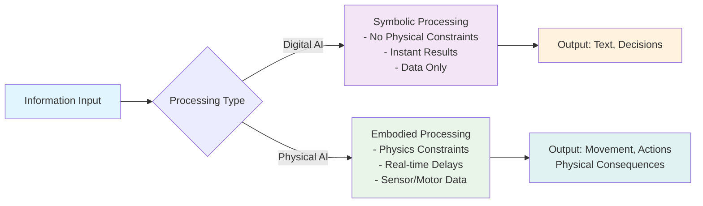
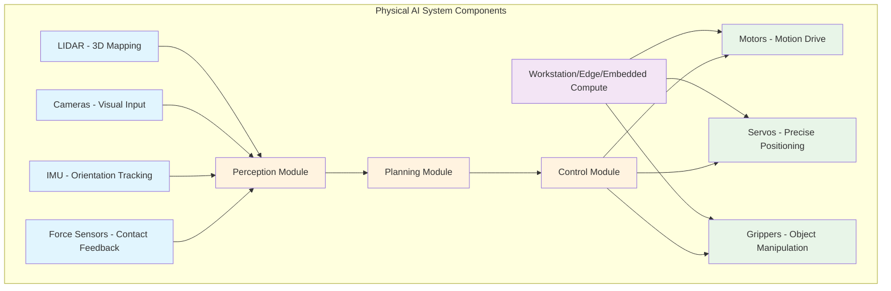

# The Dawn of Embodied Intelligence

> **Difficulty**: 🟢 Beginner (Level 1)
> **Reading Time**: 20-25 minutes
> **Prerequisites**: None - this is your starting point!

## Introduction

Imagine commanding your robot assistant to "bring me the red book from the top shelf," and watching as it gracefully navigates around furniture, identifies the correct book through its visual sensors, and carefully reaches to retrieve it—just as you envisioned. This scene represents the remarkable potential of embodied intelligence, where artificial intelligence transcends the digital realm to interact meaningfully with the physical world.

For decades, artificial intelligence has primarily existed in digital spaces—analyzing data, processing language, and making predictions without any physical presence. This digital-only AI has achieved impressive milestones, from defeating world champions in complex games to generating human-like text. However, we now stand at a transformative moment where AI systems are gaining bodies and learning to interact with the physical world in meaningful ways. This shift toward physical AI, or embodied intelligence, opens unprecedented possibilities for machines to understand and interact with our world in fundamentally human-like ways.

Embodied intelligence represents a paradigm where AI systems learn not just from data, but through direct interaction with their environment. Unlike traditional AI that processes information in isolation, embodied systems develop understanding through sensorimotor experiences—touching, moving, exploring, and adapting to real-world physics and constraints.

In this chapter, you will learn about the three core pillars that define embodied intelligence: perception systems that allow robots to sense and interpret their environment, control mechanisms that enable purposeful movement and interaction, and learning algorithms that let physical AI systems adapt and improve through experience. You will discover how these elements work together to create machines that don't just think, but think while acting in the real world. This foundation sets the stage for your journey through the textbook as we explore how embodied intelligence is reshaping robotics, automation, and human-machine interaction.

## Digital AI vs Physical AI

Understanding the distinction between digital AI and physical AI forms the foundation of your journey into embodied intelligence. You will discover how these two approaches to artificial intelligence differ fundamentally in their interaction with the world around them.

Digital AI, as you may already know, operates entirely within virtual spaces and data domains. Think of systems like ChatGPT that process and generate human language without any physical form, or image recognition algorithms that identify objects in photos without ever touching them. These systems excel at pattern recognition, data analysis, and information processing—they live in what we might call a "brain in a jar" existence, where they manipulate symbols and data without the constraints of physical reality.

Physical AI, also known as embodied intelligence, extends artificial intelligence into the tangible world. Systems like Tesla's Optimus humanoid robot or Boston Dynamics' Atlas demonstrate how AI can perceive, move, and interact with physical objects in three-dimensional space. These systems must contend with gravity, friction, momentum, and countless real-world variables that digital AI never encounters.

The comparison between these approaches reveals fundamental differences in capabilities and challenges. Digital AI processes information instantaneously without physical constraints, but lacks understanding of real-world physics and sensorimotor experiences. Physical AI must handle delays in sensor processing, mechanical limitations, and the unpredictability of physical environments, but gains rich, multimodal experiences that enable more human-like interaction with the world.

Consider the "brain in a jar" analogy: digital AI systems are like brains processing information without bodies, while physical AI systems are like brains with bodies, learning through interaction with their environment. This embodiment allows physical AI to develop understanding that emerges from the interplay between perception, action, and environmental feedback—a crucial difference that enables robots to navigate complex real-world scenarios.

```python
# Example: Digital AI vs Physical AI processing
class DigitalAI:
    def process_input(self, text):
        # Process information without physical constraints
        return self.analyze_text(text)

    def analyze_text(self, text):
        # Pure data processing
        return f"Analysis of: {text}"

class PhysicalAI:
    def process_input(self, sensor_data):
        # Must account for physical constraints and real-time processing
        perception = self.perceive_environment(sensor_data)
        action = self.plan_movement(perception)
        return self.execute_action(action)

    def perceive_environment(self, data):
        # Interpret sensor data with physical context
        return {"objects": [], "obstacles": [], "targets": []}

    def plan_movement(self, perception):
        # Account for physics, balance, and mechanical constraints
        return {"movement": "forward", "speed": 0.5}

    def execute_action(self, action):
        # Execute in physical space with real consequences
        return f"Moving: {action['movement']} at speed {action['speed']}"
```

This code example demonstrates how digital AI can process information in a purely symbolic way, while physical AI must account for real-time sensor processing, movement planning, and execution in the physical world. The digital system operates without considering time delays or physical constraints, while the physical system must handle perception, planning, and action as interconnected processes that occur in real-time with real consequences.



This diagram illustrates the fundamental processing differences between digital and physical AI systems. Digital AI processes information in a controlled, constraint-free environment, producing symbolic outputs like text or decisions. Physical AI must navigate real-world constraints including physics, time delays, and sensorimotor integration, resulting in physical actions with real-world consequences. The diagram highlights how physical AI systems close the loop between perception and action in ways that digital AI cannot, creating the foundation for truly interactive, embodied intelligence.

### Exercise: Classifying AI Systems

To reinforce your understanding of the differences between digital and physical AI, classify the following systems as either digital AI or physical AI:

1. A chatbot that answers customer service questions
2. An autonomous delivery robot navigating city sidewalks
3. A computer vision system that detects defects on a manufacturing line
4. A humanoid robot that assists elderly people with daily tasks
5. A recommendation algorithm that suggests movies on a streaming platform
6. A warehouse robot that picks and sorts packages

Think about whether each system interacts with the physical world or operates purely in digital spaces. Consider the constraints and challenges each system would face based on its classification.

## Why Humanoid Robots?

As you explore the world of Physical AI, you will discover that humanoid robots represent a fascinating intersection of engineering and practical necessity. The question naturally arises: why design robots with human-like form and capabilities when we could create machines with entirely different configurations? The answer lies in the profound reality that our world was designed for human bodies and human interaction patterns.

Our human-centered world presents countless affordances—features of the environment that suggest possible actions—that naturally accommodate bipedal beings with two arms and opposable thumbs. Consider the ubiquitous staircase, engineered for human stride length and leg strength. Door handles, light switches, tools, and even furniture are all optimized for human dimensions and manipulation capabilities. Rather than redesigning our entire infrastructure to accommodate alien-shaped robots, humanoid robots can seamlessly integrate into existing human environments.

The advantages of humanoid form factors become evident when examining specific capabilities:

• **Bipedal locomotion**: Enables navigation of human-designed spaces including stairs, narrow doorways, and uneven terrain that wheeled systems struggle to traverse
• **Dual-arm configuration**: Mirrors human manipulation capabilities, allowing effective use of tools, utensils, and equipment designed for two-handed operation
• **Anthropomorphic reach and dexterity**: Human-scale limb proportions and hand design facilitate reaching objects at various heights and manipulating items within typical human workspace dimensions
• **Social compatibility**: Human-like appearance and movement patterns reduce psychological barriers in human-robot interaction, fostering more natural collaboration and acceptance

Industry leaders recognize these advantages. Tesla's Optimus humanoid robot aims to perform factory tasks alongside humans, leveraging human-designed tools and workstations. Figure's 01 robot targets workplace assistance, designed to operate elevators, navigate office layouts, and handle objects using human-standard interfaces. Similarly, 1X Technologies develops humanoid robots for household assistance, capitalizing on the fact that homes contain countless human-centered affordances.

While alternatives like wheeled robots (such as delivery bots) and quadrupedal systems (like Boston Dynamics' Spot) offer specific advantages for particular tasks, they face inherent limitations in human environments. Wheeled robots cannot climb stairs or manipulate objects designed for standing humans, while quadrupeds lack the dual-arm dexterity essential for many manipulation tasks.

```python
# Example: Humanoid affordance utilization
class HumanoidRobot:
    def __init__(self):
        self.height = 1.7  # meters - human scale
        self.arms = 2      # dual arm configuration
        self.legs = 2      # bipedal locomotion

    def navigate_human_environment(self):
        """Demonstrate humanoid advantage in human-designed spaces"""
        affordances_used = []

        # Use human-designed affordances
        affordances_used.append(self.use_door_handle())
        affordances_used.append(self.climb_stairs())
        affordances_used.append(self.operate_light_switch())
        affordances_used.append(self.manipulate_tool())

        return affordances_used

    def use_door_handle(self):
        return "Grasped door handle with anthropomorphic hand"

    def climb_stairs(self):
        return "Navigated stairs using bipedal gait"

    def operate_light_switch(self):
        return "Pressed switch at human height with arm extension"

    def manipulate_tool(self):
        return "Used two-handed grip for tool operation"

# Alternative robot configurations
class WheeledRobot:
    def climb_stairs(self):
        return "Cannot climb stairs - limitation of wheeled design"

class QuadrupedRobot:
    def operate_light_switch(self):
        return "Cannot reach switch - lacks manipulator arms"
```

This code example illustrates how humanoid robots can leverage human-designed affordances through their anthropomorphic design. The humanoid robot successfully interacts with door handles, stairs, light switches, and tools designed for human use, while alternative configurations face inherent limitations in human environments.

```mermaid
graph TB
    A[Human-Centered Environment] --> B[Humanoid Robot Advantages]
    A --> C[Non-Humanoid Limitations]

    B --> B1[Bipedal locomotion<br/>handles stairs, doorways]
    B --> B2[Dual arms<br/>manipulate human tools]
    B --> B3[Human scale<br/>reach switches, counters]
    B --> B4[Social acceptance<br/>familiar appearance]

    C --> C1[Wheeled Robots<br/>cannot climb stairs]
    C --> C2[Quadruped Robots<br/>lack manipulation dexterity]
    C --> C3[Alien Form Factors<br/>require custom infrastructure]

    style A fill:#e3f2fd
    style B fill:#e8f5e8
    style C fill:#ffebee
    style B1 fill:#c8e6c9
    style B2 fill:#c8e6c9
    style B3 fill:#c8e6c9
    style B4 fill:#c8e6c9
    style C1 fill:#ffcdd2
    style C2 fill:#ffcdd2
    style C3 fill:#ffcdd2

## Physical AI System Components

As you dive deeper into Physical AI, you will discover that every embodied system consists of four essential components that work in harmony to create intelligent behavior in the physical world. Understanding these components is crucial for recognizing how robots perceive, process, and interact with their environment. You will learn to identify the key building blocks that enable robots to function as autonomous agents in real-world scenarios.

The first fundamental component consists of sensors that serve as the robot's eyes, ears, and sensory organs. **LIDAR (Light Detection and Ranging)** systems emit laser pulses and measure their return time to create precise 3D maps of the environment, detecting obstacles, walls, and objects with millimeter accuracy. **Cameras** capture visual information in 2D or 3D formats, enabling object recognition, color detection, and visual tracking through computer vision algorithms. **IMU (Inertial Measurement Unit)** sensors combine accelerometers and gyroscopes to track the robot's orientation, acceleration, and angular velocity, providing crucial information about balance and movement. **Force sensors** measure contact forces and torques, allowing robots to detect when they're touching objects, applying appropriate grip pressure, or encountering unexpected resistance.

The second component involves compute systems that process sensor data and execute AI algorithms. **Workstation-class computing** provides powerful processing capabilities for complex tasks like training neural networks or processing high-resolution sensor data, though it's typically tethered to external power and cooling systems. **Edge computing** delivers high performance in more compact, power-efficient packages suitable for mobile robots, balancing computational power with energy constraints. **Embedded systems** offer specialized processing optimized for specific tasks like motor control or real-time sensor fusion, trading general-purpose flexibility for efficiency and reliability.

The third component encompasses actuators that enable physical movement and interaction. **Motors** convert electrical energy into mechanical motion, driving wheels, joints, and other moving parts with precise control over speed and torque. **Servos** are specialized motors with built-in feedback mechanisms that enable precise positioning control, allowing robots to move joints to exact angles or positions. **Grippers** provide manipulation capabilities with force control systems that ensure safe interaction—applying gentle pressure when handling delicate objects while using sufficient force for robust manipulation tasks.

The fourth and final component is the software stack that orchestrates the entire system through a perception → planning → control pipeline. Perception modules process raw sensor data to extract meaningful information about the environment. Planning algorithms determine optimal actions based on goals and environmental constraints. Control systems translate high-level plans into low-level motor commands that execute physical movements.

```python
# Example: Physical AI system components working together
class PhysicalAISystem:
    def __init__(self):
        # Sensor components
        self.lidar = LIDARSensor()
        self.camera = Camera()
        self.imu = IMUSensor()
        self.force_sensors = ForceSensors()

        # Compute components
        self.compute = EdgeComputeSystem()

        # Actuator components
        self.motors = MotorArray()
        self.servos = ServoControllers()
        self.gripper = Gripper()

        # Software stack
        self.perception = PerceptionModule()
        self.planning = PlanningModule()
        self.control = ControlModule()

    def execute_task(self, goal):
        # Perception: Sense the environment
        sensor_data = {
            'lidar_data': self.lidar.scan(),
            'camera_data': self.camera.capture(),
            'imu_data': self.imu.get_orientation(),
            'force_data': self.force_sensors.get_forces()
        }

        # Planning: Determine actions
        environmental_state = self.perception.process(sensor_data)
        action_plan = self.planning.compute_action(environmental_state, goal)

        # Control: Execute movements
        motor_commands = self.control.generate_commands(action_plan)
        self.motors.execute(motor_commands)

        return "Task completed successfully"

class LIDARSensor:
    def scan(self):
        return "3D point cloud data of environment"

class Camera:
    def capture(self):
        return "Visual image data"

class IMUSensor:
    def get_orientation(self):
        return {"roll": 0.1, "pitch": 0.2, "yaw": 0.3}

class ForceSensors:
    def get_forces(self):
        return {"gripper_force": 5.2, "torque": 1.8}
```

This code example demonstrates how the four core components of a Physical AI system work together in a coordinated pipeline. The system begins by collecting data from various sensors (LIDAR, camera, IMU, force sensors), processes this information through perception modules to understand the environment, plans appropriate actions based on the goal, and finally executes those actions through motor controls. Each component plays a crucial role in the overall system, and their seamless integration enables the robot to perform complex tasks in the physical world.



This diagram visualizes the complete Physical AI system architecture, showing how sensors feed information to the perception module, which feeds the planning module, which feeds the control module. The compute system powers all processing, while actuators execute the planned actions. The diagram demonstrates the flow of information from sensing the environment to executing physical actions, with each component playing its specialized role in creating intelligent physical behavior.

## Implementation Perspective

As you embark on your journey into Physical AI, you'll discover that the challenges differ dramatically from traditional digital AI systems. Digital AI operates in a controlled, virtual environment where the primary focus centers on algorithms and data processing. You can train models on static datasets, optimize for accuracy, and iterate without immediate safety concerns.

Physical AI, however, introduces a complex web of real-world constraints that fundamentally change the implementation landscape. You will face real-time processing requirements where delays can result in catastrophic failures—imagine a robot arm moving too slowly near a human worker. Safety becomes paramount, requiring multiple fail-safes and redundant systems to prevent harm to both the robot and its environment.

Physics adds another layer of complexity. You will contend with sensor noise that corrupts input data, hardware failures that occur without warning, and the unpredictable nature of real-world environments. Unlike digital AI systems that process clean, structured data, Physical AI must interpret messy, incomplete sensor readings while managing the mechanical limitations of actuators and motors.

These implementation challenges require you to think beyond pure algorithms. You will develop skills in system integration, real-time computing, and robust design patterns that account for uncertainty and failure. The rest of this course will equip you with these essential skills, bridging the gap between theoretical AI concepts and practical embodied systems that interact with our physical world.

## Common Pitfalls

As you begin your journey into embodied intelligence, you will encounter several misconceptions that can hinder your understanding of Physical AI systems. Recognizing these common pitfalls early will help you develop a more accurate mental model of how physical AI differs from digital AI.

| Misconception | Reality | Why It Matters |
|---------------|---------|----------------|
| Physical AI is just digital AI with a body | Physical AI systems face fundamentally different challenges including real-time processing, physics constraints, and sensorimotor integration | Understanding these differences is crucial for designing appropriate algorithms and system architectures for embodied systems |
| Digital AI techniques directly apply to Physical AI | Physical AI requires specialized approaches to handle uncertainty, noise, delays, and safety constraints that don't exist in digital-only systems | You will need to adapt your knowledge of AI algorithms to account for the realities of physical interaction and real-world constraints |
| Embodied systems can operate without considering physics | Physical AI must constantly account for gravity, friction, momentum, and environmental forces | Failing to consider physical laws leads to unstable, unsafe, or ineffective robot behaviors that can result in system failures or safety incidents |

These misconceptions often arise because many students approach Physical AI with a background in digital AI, where the rules of engagement are fundamentally different. Digital AI operates in a clean, deterministic environment where inputs and outputs are well-defined and processing delays are often acceptable. Physical AI must operate in a noisy, unpredictable environment where the consequences of failure can be physical rather than just computational. As you progress through this course, you will develop an appreciation for how embodiment fundamentally changes the nature of artificial intelligence, requiring new approaches to perception, planning, and control that account for the complex interplay between software and the physical world.

## Real-World Applications

As you explore the foundations of Physical AI, you'll discover that embodied intelligence is already transforming our world. Tesla's Optimus humanoid robot demonstrates how machines can navigate human environments, while Boston Dynamics' Spot showcases advanced mobility and environmental interaction capabilities. Figure 01 represents the next generation of human-like robots designed for everyday tasks.

These aren't distant future concepts—they're today's reality. Healthcare facilities now deploy assistive robots for patient care, disaster response teams use robots to navigate dangerous environments, and space agencies prepare embodied systems for planetary exploration missions.

As you progress through this chapter, you'll understand how these applications connect to the fundamental principles you're learning. These real-world examples illustrate why mastering embodied intelligence concepts matters for building the next generation of intelligent physical systems.

## Conceptual Exercises

### Exercise 1: Scenario Analysis - Digital AI vs Physical AI

#### Instructions
Classify each of the following scenarios as either **Digital AI** or **Physical AI** and provide your reasoning. Remember that Digital AI operates primarily in digital spaces with data and information, while Physical AI (Embodied Intelligence) interacts with the physical world through sensors and actuators.

#### Scenarios to Analyze

**Scenario 1: Answering Customer Service Questions**
An AI system receives text-based inquiries from customers and responds with appropriate solutions or directs them to relevant resources.

**Scenario 2: Navigating Warehouse to Retrieve Items**
An autonomous robot moves through a warehouse, identifies specific products using computer vision, and physically retrieves them for shipping.

**Scenario 3: Generating Marketing Copy**
An AI tool analyzes market trends and consumer data to create compelling advertising content and promotional materials.

**Scenario 4: Assembling Furniture**
A robotic arm equipped with tactile sensors and cameras follows instructions to connect furniture parts, adjusting its grip strength and positioning based on real-time feedback from the physical environment.

**Scenario 5: Translating Documents**
An AI system converts written text from one language to another, processing the linguistic patterns and semantic meaning of the digital content.

#### Solutions and Reasoning

<details>
<summary>Click here to reveal the solutions and detailed reasoning</summary>

### Scenario 1: Answering Customer Service Questions - **Digital AI**
**Reasoning:** This scenario involves processing text-based information and generating text responses entirely within digital space. The AI manipulates data (customer queries) and produces outputs (responses) without any physical interaction with the environment. It operates solely on symbolic information without requiring sensors or actuators to interact with the physical world.

**Key Concept Highlighted:** Information processing without physical embodiment

### Scenario 2: Navigating Warehouse to Retrieve Items - **Physical AI**
**Reasoning:** This scenario exemplifies embodied intelligence as it requires the system to perceive its physical environment (through sensors), navigate through real space, identify physical objects, and manipulate them (through actuators). The robot must adapt to dynamic physical conditions like obstacles, lighting changes, and varying object positions.

**Key Concept Highlighted:** Sensory-motor integration with the physical world

### Scenario 3: Generating Marketing Copy - **Digital AI**
**Reasoning:** This task involves analyzing digital data patterns, statistical relationships in consumer behavior, and linguistic structures to produce written content. While the output might influence physical actions (like printing ads), the AI system itself operates purely in the digital realm, manipulating symbols and data representations.

**Key Concept Highlighted:** Purely symbolic computation without physical interaction

### Scenario 4: Assembling Furniture - **Physical AI**
**Reasoning:** This scenario requires fine-grained physical interaction with real objects, incorporating tactile feedback, visual perception of spatial relationships, and precise motor control. The robot must adapt its movements based on real-time physical feedback (resistance, alignment, etc.) that cannot be simulated digitally.

**Key Concept Highlighted:** Closed-loop sensorimotor control in physical environments

### Scenario 5: Translating Documents - **Digital AI**
**Reasoning:** Translation occurs entirely within the symbolic domain of language processing. Even though documents have physical forms, the AI processes them as digital text, converting between symbolic representations without needing to interact with physical properties of paper, ink, or real-world contexts of the translated content.

**Key Concept Highlighted:** Symbolic manipulation without environmental interaction

### Common Mistakes to Avoid

1. **Confusing digital interfaces with physical embodiment:** Just because a system has a camera or screen doesn't make it physically embodied - it must actively interact with the physical environment.

2. **Overlooking sensory feedback:** True Physical AI incorporates continuous sensing and adaptation to physical conditions, not just one-way output.

3. **Assuming all robotics are embodied:** Some robots perform repetitive tasks without adapting to environmental variations - true embodiment requires dynamic interaction with the environment.

### Key Takeaways

- **Digital AI** operates primarily on data and symbols in virtual spaces
- **Physical AI** requires sensors to perceive and actuators to act in the physical world
- **Embodied intelligence** emerges from the tight coupling between sensing, cognition, and action in real environments
- **Physical AI** must handle uncertainty, variability, and real-time constraints that don't exist in digital-only systems

</details>

### Exercise 2: Component Identification - Picking Up a Cup

**Task**: Analyze the components needed for a robot to pick up a cup from a table

As you explore embodied intelligence, understanding how different components work together is crucial. In this exercise, you will identify the essential elements needed for a robot to successfully execute the task of picking up a cup from a table.

Your mission is to identify:
1. The sensors required for this task
2. The actuators needed to perform the action
3. The planning requirements for successful execution

Take a moment to think through each component before revealing the solution below.

<details>
<summary><strong>Solution & Complete Breakdown</strong></summary>

### **Sensors Required:**

**Visual Sensors (Cameras):**
- **Purpose**: Identify the cup's location, shape, size, and orientation on the table
- **Function**: Provide spatial awareness to locate the target object and assess its position relative to the robot
- **Resolution Needed**: High enough to distinguish cup features and determine optimal grasp points

**Depth Sensors (Stereo cameras, LiDAR, or ToF sensors):**
- **Purpose**: Measure distances to the cup and surrounding objects
- **Function**: Create a 3D map of the environment to calculate precise positioning
- **Critical Role**: Prevent collisions and ensure accurate reaching motions

**Tactile Sensors (Force/torque sensors in fingertips):**
- **Purpose**: Detect contact with the cup and measure grip force
- **Function**: Confirm successful grasp and adjust pressure to prevent dropping or crushing
- **Feedback Loop**: Essential for adaptive gripping based on object weight and fragility

**Proprioceptive Sensors (Joint encoders):**
- **Purpose**: Monitor the position and movement of robotic arms and joints
- **Function**: Provide feedback on limb positioning to coordinate complex reaching and grasping motions
- **Integration**: Work with visual sensors to align hand with cup position

### **Actuators Required:**

**Arm Actuators (Servo motors or hydraulic systems):**
- **Function**: Control the movement of multiple joints in the robotic arm
- **Precision Required**: Fine control for smooth, coordinated motion to reach and grasp
- **Torque Considerations**: Sufficient strength to lift the cup while maintaining delicate control

**Gripper Actuators:**
- **Function**: Open and close the gripper fingers with variable force
- **Control Type**: Precise force regulation to accommodate different cup materials and weights
- **Configuration**: May include parallel jaw grippers or multi-fingered hands depending on cup shape

**Base Actuators (if mobile robot):**
- **Function**: Position the robot optimally relative to the table and cup
- **Movement**: May include wheels, tracks, or legged locomotion systems
- **Coordination**: Work with arm actuators for optimal reaching position

### **Planning Requirements:**

**Path Planning:**
- **Obstacle Avoidance**: Calculate collision-free trajectories from current position to cup
- **Workspace Constraints**: Account for physical limitations of the robot's reach and joint angles
- **Dynamic Adjustment**: Adapt paths if obstacles appear or cup position changes

**Grasp Planning:**
- **Contact Points**: Determine optimal finger placement based on cup geometry
- **Force Distribution**: Plan grip force appropriate for cup material and contents
- **Approach Angle**: Calculate best angle to approach the cup for secure grasp

**Motion Sequencing:**
- **Step-by-Step Execution**: Coordinate reaching, grasping, and lifting in proper sequence
- **Timing Coordination**: Ensure each phase completes before initiating the next
- **Recovery Plans**: Prepare alternative strategies if initial attempts fail

### **System Architecture Visualization:**

```
[ENVIRONMENT] → [SENSORS] → [PLANNING] → [ACTUATORS] → [ACTION]
     ↓              ↓          ↓           ↓           ↓
  Cup on table  • Cameras   • Path       • Arm       • Reach &
                • Depth     • Grasp      • Gripper   • Grasp
                • Tactile   • Motion     • Base      • Lift
                • Proprio-
```

This interconnected system demonstrates how embodied intelligence requires seamless integration of perception, cognition, and action to accomplish even simple tasks like picking up a cup.

</details>

## Key Takeaways

• **You will understand that Physical AI represents the convergence of artificial intelligence with physical systems**, enabling machines to perceive, reason, and act in real-world environments through sensors, actuators, and embodied cognition principles.

• **You will recognize how embodied intelligence differs fundamentally from traditional AI systems** by emphasizing the importance of physical interaction, environmental feedback, and the role of the body in shaping intelligent behavior and learning.

• **You will appreciate the historical evolution from disembodied AI to embodied systems**, tracing the development from early symbolic AI approaches to modern robotics that integrate perception, cognition, and action in unified frameworks.

• **You will identify the core components that enable embodied intelligence in robotic systems**, including sensing capabilities, computational processing, motor control systems, and learning mechanisms that adapt to environmental interactions.

• **You will grasp the transformative potential of Physical AI across diverse applications**, from autonomous vehicles and assistive robotics to industrial automation and human-robot collaboration in real-world settings.

## Further Reading

As you continue your journey into embodied intelligence, these carefully selected resources will deepen your understanding of Physical AI concepts and applications. Each resource offers unique perspectives that complement what you've learned in this chapter.

**[Embodied Cognition: An Introduction](https://example.com/embodied-cognition-intro)** - This comprehensive resource explores the philosophical and theoretical foundations of embodied cognition, explaining how the body influences cognitive processes. You will discover how physical interaction with the environment shapes intelligence, providing crucial context for understanding why embodiment matters in AI systems.

**[Robotics: Science and Systems Conference Proceedings](https://example.com/rss-proceedings)** - Access cutting-edge research from the premier robotics conference that focuses on the intersection of robotics and AI. These proceedings showcase the latest advances in embodied intelligence, including perception, control, and learning algorithms for physical systems. You will find detailed technical papers that expand on the concepts introduced in this chapter.

**[The Handbook of Embodied AI](https://example.com/embodied-ai-handbook)** - This authoritative reference covers the full spectrum of embodied AI research, from biological inspiration to engineering implementation. You will explore how nature's solutions to embodied intelligence inform robotic design and learn about the mathematical foundations underlying physical AI systems.

**[MIT Physical Intelligence Lab Publications](https://example.com/mit-physical-intelligence)** - Browse publications from one of the world's leading research groups focused on Physical AI. These papers demonstrate practical applications of embodied intelligence principles, showing how theoretical concepts translate into working robotic systems. You will gain insights into current research directions and emerging trends in the field.

## Next Chapter Preview

As you continue your journey into Physical AI, you will explore the vibrant ecosystem that brings embodied intelligence to life in the next chapter. You will discover how diverse components—from sensors and actuators to compute platforms and software frameworks—integrate to create sophisticated robotic systems. This upcoming chapter will provide you with the technical depth needed to understand how modern Physical AI systems are architected, implemented, and deployed in real-world applications.