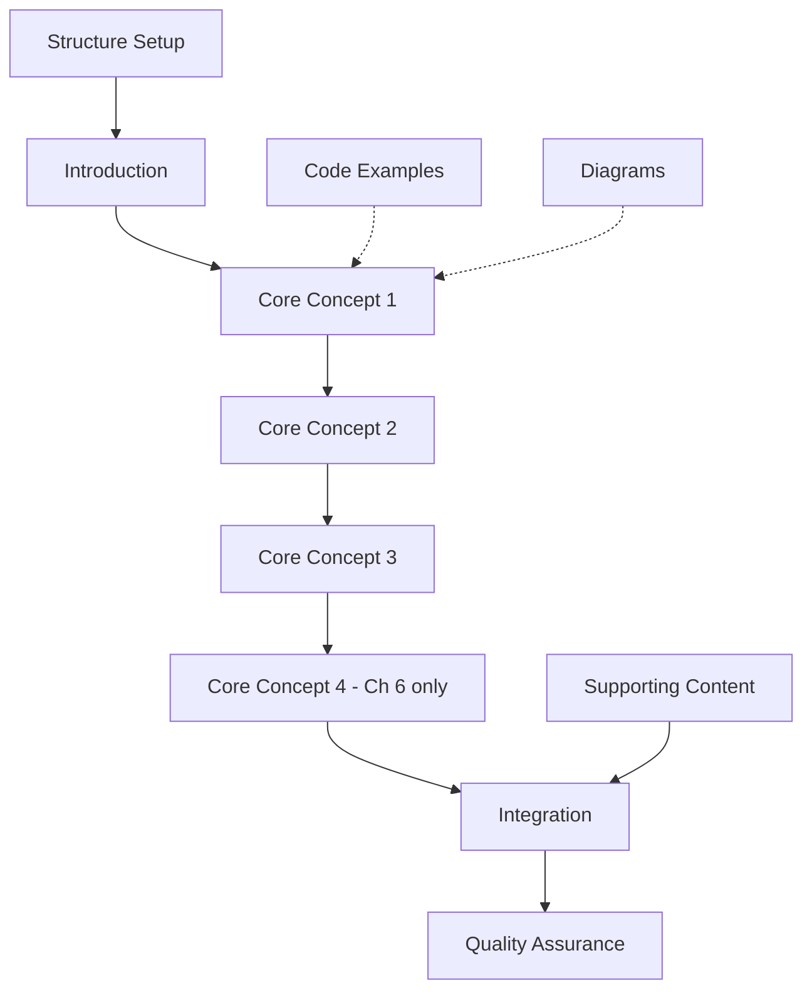

# Tasks for Physical AI & Robotics Course Chapters (2-22)

## Task Summary Table

| Metric | Value |
|--------|-------|
| Total Tasks | 462 |
| Total Estimated Time | ~2,400 minutes (40 hours) |
| Orchestrator Tasks | 92 |
| Content Writer Tasks | 154 |
| Code Architect Tasks | 154 |
| Diagram Designer Tasks | 62 |
| Critical Path Duration | ~140 minutes (Chapter 6) |

## Dependency Graph

## Phase-by-Phase Task List

### Phase 1: Setup and Project Structure

- [X] T001 Create docs/part-1-foundations directory
- [X] T002 Create docs/part-2-ros2 directory
- [X] T003 Create docs/part-3-simulation directory
- [X] T004 Create docs/part-4-isaac directory
- [X] T005 Create docs/part-5-vla directory
- [X] T006 Create docs/part-6-deployment directory

## Chapter 2: The Physical AI Ecosystem (Level 2)

### Phase 2.1: Structure & Setup (10 min)

- [X] T007 [P] Create chapter file at docs/part-1-foundations/chapter-02-ecosystem.md
- [X] T008 [P] Add frontmatter with sidebar_position: 2 and title
- [X] T009 [P] Generate section template from chapter-structure skill
- [X] T010 Verify structure matches constitution

### Phase 2.2: Content Creation (75 min)

*Writing Tasks (Sequential):*
- [X] T011 Write introduction (250-350 words)
- [X] T012 Write Core Concept 1 text (300-450 words)
- [X] T013 Write Core Concept 2 text (300-450 words)
- [X] T014 Write Core Concept 3 text (300-450 words)
- [X] T015 Write Implementation Perspective (150-250 words)

*Code Tasks (Parallel):*
- [X] T016 [P] [CH2] Create Code Example 1: Basic ROS 2 Publisher/Subscriber (40-50 lines)
- [X] T017 [P] [CH2] Write explanation for Example 1 (100-150 words)
- [X] T018 [P] [CH2] Create Code Example 2: Simple Service/Client Implementation (45-55 lines)
- [X] T019 [P] [CH2] Write explanation for Example 2 (100-150 words)
- [X] T020 [P] [CH2] Create Code Example 3: Parameter Management in ROS 2 (50-65 lines)
- [X] T021 [P] [CH2] Write explanation for Example 3 (100-150 words)
- [X] T022 [P] [CH2] Create Code Example 4: Action Server/Client Pattern (60-70 lines) - if needed
- [X] T023 [P] [CH2] Write explanation for Example 4 (100-150 words)

*Diagram Tasks (Parallel):*
- [X] T024 [P] [CH2] Create Diagram 1: ROS 2 Architecture Overview
- [X] T025 [P] [CH2] Create Diagram 2: Physical AI Hardware Stack
- [X] T026 [P] [CH2] Create Diagram 3: Communication Patterns Comparison

*Integration Tasks:*
- [X] T027 [CH2] Integrate all code examples into correct sections
- [X] T028 [CH2] Integrate all diagrams into correct sections
- [X] T029 [CH2] Ensure flow and transitions

### Phase 2.3: Supporting Content (20 min)

- [X] T030 [CH2] Write Common Pitfalls table (3-4 issues)
- [X] T031 [CH2] Write Real-World Applications (100-150 words)
- [X] T032 [CH2] Create Exercise 1: Modify publisher/subscriber with error handling
- [X] T033 [CH2] Create Exercise 2: Create parameter configuration for robot
- [X] T034 [CH2] Write complete solutions for all exercises
- [X] T035 [CH2] Write Key Takeaways (5 bullets)
- [X] T036 [CH2] Write Further Reading (3-4 links with descriptions)
- [X] T037 [CH2] Write Next Chapter Preview (2-3 sentences)

### Phase 2.4: Integration & Final Assembly (10 min)

- [X] T038 [CH2] Final integration of all sections
- [X] T039 [CH2] Add cross-references and links
- [X] T040 [CH2] Ensure consistent formatting

### Phase 2.5: Quality Assurance (15 min)

- [X] T041 [CH2] Validate word count (1,200-1,500 words)
- [X] T042 [CH2] Validate all code examples complete and documented
- [X] T043 [CH2] Validate all diagrams render correctly
- [X] T044 [CH2] Validate exercises have complete solutions
- [X] T045 [CH2] Spell/grammar check
- [X] T046 [CH2] Test in Docusaurus dev server
- [X] T047 [CH2] Verify mobile responsiveness
- [X] T048 [CH2] Run full constitution checklist

### Phase 2.6: Final Checkpoint (5 min)

- [X] T049 [CH2] Confirm all quality criteria met
- [X] T050 [CH2] Mark chapter complete
- [X] T051 [CH2] Save final version

## Chapter 3: ROS 2 Architecture Fundamentals (Level 3)

### Phase 3.1: Structure & Setup (10 min)

- [X] T052 [P] Create chapter file at docs/part-2-ros2/chapter-03-architecture.md
- [X] T053 [P] Add frontmatter with sidebar_position: 3 and title
- [X] T054 [P] Generate section template from chapter-structure skill
- [X] T055 Verify structure matches constitution

### Phase 3.2: Content Creation (85 min)

*Writing Tasks (Sequential):*
- [X] T056 Write introduction (250-350 words)
- [X] T057 Write Core Concept 1 text: Node Lifecycle Management (300-450 words)
- [X] T058 Write Core Concept 2 text: QoS Policies (300-450 words)
- [X] T059 Write Core Concept 3 text: Client Libraries (300-450 words)
- [X] T060 Write Core Concept 4 text: Component-Based Architecture (300-450 words)
- [X] T061 Write Implementation Perspective (150-250 words)

*Code Tasks (Parallel):*
- [X] T062 [P] [CH3] Create Code Example 1: Node Lifecycle Management (70-85 lines)
- [X] T063 [P] [CH3] Write explanation for Example 1 (100-150 words)
- [X] T064 [P] [CH3] Create Code Example 2: DDS Middleware Configuration (75-90 lines)
- [X] T065 [P] [CH3] Write explanation for Example 2 (100-150 words)
- [X] T066 [P] [CH3] Create Code Example 3: Client Library Comparison (80-95 lines)
- [X] T067 [P] [CH3] Write explanation for Example 3 (100-150 words)
- [X] T068 [P] [CH3] Create Code Example 4: Action Server with Feedback (85-100 lines)
- [X] T069 [P] [CH3] Write explanation for Example 4 (100-150 words)
- [X] T070 [P] [CH3] Create Code Example 5: Composition and Node Containers (90-100 lines)
- [X] T071 [P] [CH3] Write explanation for Example 5 (100-150 words)

*Diagram Tasks (Parallel):*
- [X] T072 [P] [CH3] Create Diagram 1: ROS 2 Architecture Layers
- [X] T073 [P] [CH3] Create Diagram 2: QoS Policy Relationships
- [X] T074 [P] [CH3] Create Diagram 3: Node Lifecycle States
- [X] T075 [P] [CH3] Create Diagram 4: Component Composition Architecture

*Integration Tasks:*
- [X] T076 [CH3] Integrate all code examples into correct sections
- [X] T077 [CH3] Integrate all diagrams into correct sections
- [X] T078 [CH3] Ensure flow and transitions

### Phase 3.3: Supporting Content (20 min)

- [X] T079 [CH3] Write Common Pitfalls table (4 issues)
- [X] T080 [CH3] Write Real-World Applications (100-150 words)
- [X] T081 [CH3] Create Exercise 1: Implement lifecycle node with custom transitions
- [X] T082 [CH3] Create Exercise 2: Configure QoS policies for time-sensitive app
- [X] T083 [CH3] Create Exercise 3: Create component-based system for sensor fusion
- [X] T084 [CH3] Write complete solutions for all exercises
- [X] T085 [CH3] Write Key Takeaways (5 bullets)
- [X] T086 [CH3] Write Further Reading (3-4 links with descriptions)
- [X] T087 [CH3] Write Next Chapter Preview (2-3 sentences)

### Phase 3.4: Integration & Final Assembly (15 min)

- [X] T088 [CH3] Final integration of all sections
- [X] T089 [CH3] Add cross-references and links
- [X] T090 [CH3] Ensure consistent formatting

### Phase 3.5: Quality Assurance (15 min)

- [X] T091 [CH3] Validate word count (1,500-1,800 words)
- [X] T092 [CH3] Validate all code examples complete and documented
- [X] T093 [CH3] Validate all diagrams render correctly
- [X] T094 [CH3] Validate exercises have complete solutions
- [X] T095 [CH3] Spell/grammar check
- [X] T096 [CH3] Test in Docusaurus dev server
- [X] T097 [CH3] Verify mobile responsiveness
- [X] T098 [CH3] Run full constitution checklist

### Phase 3.6: Final Checkpoint (5 min)

- [X] T099 [CH3] Confirm all quality criteria met
- [X] T100 [CH3] Mark chapter complete
- [X] T101 [CH3] Save final version

## Chapter 4: Building with ROS 2 and Python (Level 4)

### Phase 4.1: Structure & Setup (10 min)

- [X] T102 [P] Create chapter file at docs/part-2-ros2/chapter-04-python.md
- [X] T103 [P] Add frontmatter with sidebar_position: 4 and title
- [X] T104 [P] Generate section template from chapter-structure skill
- [X] T105 Verify structure matches constitution

### Phase 4.2: Content Creation (90 min)

*Writing Tasks (Sequential):*
- [X] T106 Write introduction (250-350 words)
- [X] T107 Write Core Concept 1 text: Custom Message Types (300-450 words)
- [X] T108 Write Core Concept 2 text: Async Programming Patterns (300-450 words)
- [X] T109 Write Core Concept 3 text: Testing and Quality Assurance (300-450 words)
- [X] T110 Write Core Concept 4 text: Performance Optimization (300-450 words)
- [X] T111 Write Implementation Perspective (150-250 words)

*Code Tasks (Parallel):*
- [X] T112 [P] [CH4] Create Code Example 1: Custom Message Types (95-110 lines)
- [X] T113 [P] [CH4] Write explanation for Example 1 (100-150 words)
- [X] T114 [P] [CH4] Create Code Example 2: Async Programming (100-115 lines)
- [X] T115 [P] [CH4] Write explanation for Example 2 (100-150 words)
- [X] T116 [P] [CH4] Create Code Example 3: Testing and Mocking (105-120 lines)
- [X] T117 [P] [CH4] Write explanation for Example 3 (100-150 words)
- [X] T118 [P] [CH4] Create Code Example 4: Performance Optimization (110-120 lines)
- [X] T119 [P] [CH4] Write explanation for Example 4 (100-150 words)
- [X] T120 [P] [CH4] Create Code Example 5: Python Package Structure (115-120 lines)
- [X] T121 [P] [CH4] Write explanation for Example 5 (100-150 words)

*Diagram Tasks (Parallel):*
- [X] T122 [P] [CH4] Create Diagram 1: Python ROS 2 Client Library Architecture
- [X] T123 [P] [CH4] Create Diagram 2: Async Programming Flow in Python Nodes
- [X] T124 [P] [CH4] Create Diagram 3: Python Package Structure for ROS 2
- [X] T125 [P] [CH4] Create Diagram 4: Testing Architecture in Python

*Integration Tasks:*
- [X] T126 [CH4] Integrate all code examples into correct sections
- [X] T127 [CH4] Integrate all diagrams into correct sections
- [X] T128 [CH4] Ensure flow and transitions

### Phase 4.3: Supporting Content (20 min)

- [X] T129 [CH4] Write Common Pitfalls table (4 issues)
- [X] T130 [CH4] Write Real-World Applications (100-150 words)
- [X] T131 [CH4] Create Exercise 1: Create custom message and implement node
- [X] T132 [CH4] Create Exercise 2: Convert sync node to use async patterns
- [X] T133 [CH4] Create Exercise 3: Write comprehensive tests for Python ROS 2 node
- [X] T134 [CH4] Write complete solutions for all exercises
- [X] T135 [CH4] Write Key Takeaways (5 bullets)
- [X] T136 [CH4] Write Further Reading (3-4 links with descriptions)
- [X] T137 [CH4] Write Next Chapter Preview (2-3 sentences)

### Phase 4.4: Integration & Final Assembly (15 min)

- [X] T138 [CH4] Final integration of all sections
- [X] T139 [CH4] Add cross-references and links
- [X] T140 [CH4] Ensure consistent formatting

### Phase 4.5: Quality Assurance (15 min)

- [X] T141 [CH4] Validate word count (1,500-1,800 words)
- [X] T142 [CH4] Validate all code examples complete and documented
- [X] T143 [CH4] Validate all diagrams render correctly
- [X] T144 [CH4] Validate exercises have complete solutions
- [X] T145 [CH4] Spell/grammar check
- [X] T146 [CH4] Test in Docusaurus dev server
- [X] T147 [CH4] Verify mobile responsiveness
- [X] T148 [CH4] Run full constitution checklist

### Phase 4.6: Final Checkpoint (5 min)

- [X] T149 [CH4] Confirm all quality criteria met
- [X] T150 [CH4] Mark chapter complete
- [X] T151 [CH4] Save final version

## Chapter 5: Describing Robots with URDF (Level 5)

### Phase 5.1: Structure & Setup (10 min)

- [X] T152 [P] Create chapter file at docs/part-2-ros2/chapter-05-urdf.md
- [X] T153 [P] Add frontmatter with sidebar_position: 5 and title
- [X] T154 [P] Generate section template from chapter-structure skill
- [X] T155 Verify structure matches constitution

### Phase 5.2: Content Creation (95 min)

*Writing Tasks (Sequential):*
- [X] T156 Write introduction (250-350 words)
- [X] T157 Write Core Concept 1 text: Basic URDF Structure (300-450 words)
- [X] T158 Write Core Concept 2 text: Visual Properties and Materials (300-450 words)
- [X] T159 Write Core Concept 3 text: Hardware Integration (300-450 words)
- [X] T160 Write Core Concept 4 text: Xacro for Parameterized Design (300-450 words)
- [X] T161 Write Implementation Perspective (150-250 words)

*Code Tasks (Parallel):*
- [X] T162 [P] [CH5] Create Code Example 1: Basic Robot Model with Links and Joints (85-100 lines)
- [X] T163 [P] [CH5] Write explanation for Example 1 (100-150 words)
- [X] T164 [P] [CH5] Create Code Example 2: Complex Geometries and Materials (90-110 lines)
- [X] T165 [P] [CH5] Write explanation for Example 2 (100-150 words)
- [X] T166 [P] [CH5] Create Code Example 3: URDF with Transmission and Actuator Definitions (95-115 lines)
- [X] T167 [P] [CH5] Write explanation for Example 3 (100-150 words)
- [X] T168 [P] [CH5] Create Code Example 4: Xacro Macros for Complex Robot Assembly (100-120 lines)
- [X] T169 [P] [CH5] Write explanation for Example 4 (100-150 words)
- [X] T170 [P] [CH5] Create Code Example 5: URDF with Sensor Definitions and Gazebo Integration (105-130 lines)
- [X] T171 [P] [CH5] Write explanation for Example 5 (100-150 words)

*Diagram Tasks (Parallel):*
- [X] T172 [P] [CH5] Create Diagram 1: URDF Robot Model Structure
- [X] T173 [P] [CH5] Create Diagram 2: Robot Kinematic Chain
- [X] T174 [P] [CH5] Create Diagram 3: URDF to Simulation Pipeline
- [X] T175 [P] [CH5] Create Diagram 4: Xacro Parameterization Structure

*Integration Tasks:*
- [X] T176 [CH5] Integrate all code examples into correct sections
- [X] T177 [CH5] Integrate all diagrams into correct sections
- [X] T178 [CH5] Ensure flow and transitions

### Phase 5.3: Supporting Content (20 min)

- [X] T179 [CH5] Write Common Pitfalls table (4 issues)
- [X] T180 [CH5] Write Real-World Applications (100-150 words)
- [X] T181 [CH5] Create Exercise 1: Create URDF for simple 3-DOF manipulator
- [X] T182 [CH5] Create Exercise 2: Convert basic URDF to use Xacro macros
- [X] T183 [CH5] Create Exercise 3: Add sensor definitions to existing robot model
- [X] T184 [CH5] Write complete solutions for all exercises
- [X] T185 [CH5] Write Key Takeaways (5 bullets)
- [X] T186 [CH5] Write Further Reading (3-4 links with descriptions)
- [X] T187 [CH5] Write Next Chapter Preview (2-3 sentences)

### Phase 5.4: Integration & Final Assembly (15 min)

- [X] T188 [CH5] Final integration of all sections
- [X] T189 [CH5] Add cross-references and links
- [X] T190 [CH5] Ensure consistent formatting

### Phase 5.5: Quality Assurance (15 min)

- [X] T191 [CH5] Validate word count (1,500-1,800 words)
- [X] T192 [CH5] Validate all code examples complete and documented
- [X] T193 [CH5] Validate all diagrams render correctly
- [X] T194 [CH5] Validate exercises have complete solutions
- [X] T195 [CH5] Spell/grammar check
- [X] T196 [CH5] Test in Docusaurus dev server
- [X] T197 [CH5] Verify mobile responsiveness
- [X] T198 [CH5] Run full constitution checklist

### Phase 5.6: Final Checkpoint (5 min)

- [X] T199 [CH5] Confirm all quality criteria met
- [X] T200 [CH5] Mark chapter complete
- [X] T201 [CH5] Save final version

## Chapter 6: Launch Files and System Integration (Level 6)

### Phase 6.1: Structure & Setup (10 min)

- [X] T202 [P] Create chapter file at docs/part-2-ros2/chapter-06-launch.md
- [X] T203 [P] Add frontmatter with sidebar_position: 6 and title
- [X] T204 [P] Generate section template from chapter-structure skill
- [X] T205 Verify structure matches constitution

### Phase 6.2: Content Creation (105 min)

*Writing Tasks (Sequential):*
- [X] T206 Write introduction (250-350 words)
- [X] T207 Write Core Concept 1 text: Basic Launch File Structure (300-450 words)
- [X] T208 Write Core Concept 2 text: Conditional Launch and Event Handling (300-450 words)
- [X] T209 Write Core Concept 3 text: Parameter Substitution and Remapping (300-450 words)
- [X] T210 Write Core Concept 4 text: Composable Node Launching (300-450 words)
- [X] T211 Write Core Concept 5 text: Multi-Robot System Launch (300-450 words)
- [X] T212 Write Implementation Perspective (150-250 words)

*Code Tasks (Parallel):*
- [X] T213 [P] [CH6] Create Code Example 1: Basic Launch File with Multiple Nodes (100-120 lines)
- [X] T214 [P] [CH6] Write explanation for Example 1 (100-150 words)
- [X] T215 [P] [CH6] Create Code Example 2: Conditional Launch and Event Handling (110-130 lines)
- [X] T216 [P] [CH6] Write explanation for Example 2 (100-150 words)
- [X] T217 [P] [CH6] Create Code Example 3: Parameter Substitution and Remapping (115-135 lines)
- [X] T218 [P] [CH6] Write explanation for Example 3 (100-150 words)
- [X] T219 [P] [CH6] Create Code Example 4: Composable Nodes and Component Containers (120-140 lines)
- [X] T220 [P] [CH6] Write explanation for Example 4 (100-150 words)
- [X] T221 [P] [CH6] Create Code Example 5: Launch File with Configuration Files (125-145 lines)
- [X] T222 [P] [CH6] Write explanation for Example 5 (100-150 words)
- [X] T223 [P] [CH6] Create Code Example 6: Multi-Robot Launch System (130-150 lines)
- [X] T224 [P] [CH6] Write explanation for Example 6 (100-150 words)

*Diagram Tasks (Parallel):*
- [X] T225 [P] [CH6] Create Diagram 1: Launch File Architecture
- [X] T226 [P] [CH6] Create Diagram 2: Launch Event Flow
- [X] T227 [P] [CH6] Create Diagram 3: Parameter Substitution System
- [X] T228 [P] [CH6] Create Diagram 4: Composable Node Architecture
- [X] T229 [P] [CH6] Create Diagram 5: Multi-Robot System Launch

*Integration Tasks:*
- [X] T230 [CH6] Integrate all code examples into correct sections
- [X] T231 [CH6] Integrate all diagrams into correct sections
- [X] T232 [CH6] Ensure flow and transitions

### Phase 6.3: Supporting Content (25 min)

- [X] T233 [CH6] Write Common Pitfalls table (4 issues)
- [X] T234 [CH6] Write Real-World Applications (100-150 words)
- [X] T235 [CH6] Create Exercise 1: Create launch file for sensor suite
- [X] T236 [CH6] Create Exercise 2: Implement conditional launch logic for fault recovery
- [X] T237 [CH6] Create Exercise 3: Design multi-robot launch system with coordination
- [X] T238 [CH6] Write complete solutions for all exercises
- [X] T239 [CH6] Write Key Takeaways (5 bullets)
- [X] T240 [CH6] Write Further Reading (3-4 links with descriptions)
- [X] T241 [CH6] Write Next Chapter Preview (2-3 sentences)

### Phase 6.4: Integration & Final Assembly (15 min)

- [X] T242 [CH6] Final integration of all sections
- [X] T243 [CH6] Add cross-references and links
- [X] T244 [CH6] Ensure consistent formatting

### Phase 6.5: Quality Assurance (15 min)

- [X] T245 [CH6] Validate word count (1,800-2,000 words)
- [X] T246 [CH6] Validate all code examples complete and documented
- [X] T247 [CH6] Validate all diagrams render correctly
- [X] T248 [CH6] Validate exercises have complete solutions
- [X] T249 [CH6] Spell/grammar check
- [X] T250 [CH6] Test in Docusaurus dev server
- [X] T251 [CH6] Verify mobile responsiveness
- [X] T252 [CH6] Run full constitution checklist

### Phase 6.6: Final Checkpoint (5 min)

- [X] T253 [CH6] Confirm all quality criteria met
- [X] T254 [CH6] Mark chapter complete
- [X] T255 [CH6] Save final version

## Chapter 7: Physics Simulation Gazebo (Summary)

### Phase 7.1: Structure (5 min)

- [X] T256 [P] Create chapter file at docs/part-3-simulation/chapter-07-gazebo.md
- [X] T257 [P] Add frontmatter with sidebar_position: 7 and title
- [X] T258 [P] Generate section headings

### Phase 7.2: Content Creation (12 min)

- [X] T259 [CH7] Write all 400-500 words content:
  - Learning objectives (3-5 bullets)
  - Key topics (150-200 words)
  - Prerequisites list
  - What you'll build (50-75 words)
  - Real-world applications (75-100 words)
  - Why this matters (75-100 words)
  - Coming soon details (50-75 words)
  - Related resources (2-3 links)

### Phase 7.3: Quality Check (3 min)

- [X] T260 [CH7] Validate word count (400-500)
- [X] T261 [CH7] Check formatting
- [X] T262 [CH7] Test in Docusaurus

## Chapter 8: Sensor Simulation (Summary)

### Phase 8.1: Structure (5 min)

- [X] T263 [P] Create chapter file at docs/part-3-simulation/chapter-08-sensor-simulation.md
- [X] T264 [P] Add frontmatter with sidebar_position: 8 and title
- [X] T265 [P] Generate section headings

### Phase 8.2: Content Creation (12 min)

- [X] T266 [CH8] Write all 400-500 words content:
  - Learning objectives (3-5 bullets)
  - Key topics (150-200 words)
  - Prerequisites list
  - What you'll build (50-75 words)
  - Real-world applications (75-100 words)
  - Why this matters (75-100 words)
  - Coming soon details (50-75 words)
  - Related resources (2-3 links)

### Phase 8.3: Quality Check (3 min)

- [X] T267 [CH8] Validate word count (400-500)
- [X] T268 [CH8] Check formatting
- [X] T269 [CH8] Test in Docusaurus

## Chapter 9: Unity High-Fidelity Visualization (Summary)

### Phase 9.1: Structure (5 min)

- [X] T270 [P] Create chapter file at docs/part-3-simulation/chapter-09-unity-visualization.md
- [X] T271 [P] Add frontmatter with sidebar_position: 9 and title
- [X] T272 [P] Generate section headings

### Phase 9.2: Content Creation (12 min)

- [X] T273 [CH9] Write all 400-500 words content:
  - Learning objectives (3-5 bullets)
  - Key topics (150-200 words)
  - Prerequisites list
  - What you'll build (50-75 words)
  - Real-world applications (75-100 words)
  - Why this matters (75-100 words)
  - Coming soon details (50-75 words)
  - Related resources (2-3 links)

### Phase 9.3: Quality Check (3 min)

- [X] T274 [CH9] Validate word count (400-500)
- [X] T275 [CH9] Check formatting
- [X] T276 [CH9] Test in Docusaurus

## Chapter 10: NVIDIA Isaac Ecosystem Overview (Summary)

### Phase 10.1: Structure (5 min)

- [X] T277 [P] Create chapter file at docs/part-4-isaac/chapter-10-isaac-ecosystem.md
- [X] T278 [P] Add frontmatter with sidebar_position: 10 and title
- [X] T279 [P] Generate section headings

### Phase 10.2: Content Creation (12 min)

- [X] T280 [CH10] Write all 400-500 words content:
  - Learning objectives (3-5 bullets)
  - Key topics (150-200 words)
  - Prerequisites list
  - What you'll build (50-75 words)
  - Real-world applications (75-100 words)
  - Why this matters (75-100 words)
  - Coming soon details (50-75 words)
  - Related resources (2-3 links)

### Phase 10.3: Quality Check (3 min)

- [X] T281 [CH10] Validate word count (400-500)
- [X] T282 [CH10] Check formatting
- [X] T283 [CH10] Test in Docusaurus

## Chapter 11: Isaac Sim Photorealistic Simulation (Summary)

### Phase 11.1: Structure (5 min)

- [X] T284 [P] Create chapter file at docs/part-4-isaac/chapter-11-isaac-sim.md
- [X] T285 [P] Add frontmatter with sidebar_position: 11 and title
- [X] T286 [P] Generate section headings

### Phase 11.2: Content Creation (12 min)

- [X] T287 [CH11] Write all 400-500 words content:
  - Learning objectives (3-5 bullets)
  - Key topics (150-200 words)
  - Prerequisites list
  - What you'll build (50-75 words)
  - Real-world applications (75-100 words)
  - Why this matters (75-100 words)
  - Coming soon details (50-75 words)
  - Related resources (2-3 links)

### Phase 11.3: Quality Check (3 min)

- [X] T288 [CH11] Validate word count (400-500)
- [X] T289 [CH11] Check formatting
- [X] T290 [CH11] Test in Docusaurus

## Chapter 12: Isaac ROS Hardware-Accelerated Perception (Summary)

### Phase 12.1: Structure (5 min)

- [X] T291 [P] Create chapter file at docs/part-4-isaac/chapter-12-isaac-ros-perception.md
- [X] T292 [P] Add frontmatter with sidebar_position: 12 and title
- [X] T293 [P] Generate section headings

### Phase 12.2: Content Creation (12 min)

- [X] T294 [CH12] Write all 400-500 words content:
  - Learning objectives (3-5 bullets)
  - Key topics (150-200 words)
  - Prerequisites list
  - What you'll build (50-75 words)
  - Real-world applications (75-100 words)
  - Why this matters (75-100 words)
  - Coming soon details (50-75 words)
  - Related resources (2-3 links)

### Phase 12.3: Quality Check (3 min)

- [X] T295 [CH12] Validate word count (400-500)
- [X] T296 [CH12] Check formatting
- [X] T297 [CH12] Test in Docusaurus

## Chapter 13: Navigation with Nav2 (Summary)

### Phase 13.1: Structure (5 min)

- [X] T298 [P] Create chapter file at docs/part-4-isaac/chapter-13-navigation-nav2.md
- [X] T299 [P] Add frontmatter with sidebar_position: 13 and title
- [X] T300 [P] Generate section headings

### Phase 13.2: Content Creation (12 min)

- [X] T301 [CH13] Write all 400-500 words content:
  - Learning objectives (3-5 bullets)
  - Key topics (150-200 words)
  - Prerequisites list
  - What you'll build (50-75 words)
  - Real-world applications (75-100 words)
  - Why this matters (75-100 words)
  - Coming soon details (50-75 words)
  - Related resources (2-3 links)

### Phase 13.3: Quality Check (3 min)

- [X] T302 [CH13] Validate word count (400-500)
- [X] T303 [CH13] Check formatting
- [X] T304 [CH13] Test in Docusaurus

## Chapter 14: Humanoid Kinematics Dynamics (Summary)

### Phase 14.1: Structure (5 min)

- [X] T305 [P] Create chapter file at docs/part-5-vla/chapter-14-humanoid-kinematics.md
- [X] T306 [P] Add frontmatter with sidebar_position: 14 and title
- [X] T307 [P] Generate section headings

### Phase 14.2: Content Creation (12 min)

- [X] T308 [CH14] Write all 400-500 words content:
  - Learning objectives (3-5 bullets)
  - Key topics (150-200 words)
  - Prerequisites list
  - What you'll build (50-75 words)
  - Real-world applications (75-100 words)
  - Why this matters (75-100 words)
  - Coming soon details (50-75 words)
  - Related resources (2-3 links)

### Phase 14.3: Quality Check (3 min)

- [X] T309 [CH14] Validate word count (400-500)
- [X] T310 [CH14] Check formatting
- [X] T311 [CH14] Test in Docusaurus

## Chapter 15: Manipulation Grasping (Summary)

### Phase 15.1: Structure (5 min)

- [X] T312 [P] Create chapter file at docs/part-5-vla/chapter-15-manipulation-grasping.md
- [X] T313 [P] Add frontmatter with sidebar_position: 15 and title
- [X] T314 [P] Generate section headings

### Phase 15.2: Content Creation (12 min)

- [X] T315 [CH15] Write all 400-500 words content:
  - Learning objectives (3-5 bullets)
  - Key topics (150-200 words)
  - Prerequisites list
  - What you'll build (50-75 words)
  - Real-world applications (75-100 words)
  - Why this matters (75-100 words)
  - Coming soon details (50-75 words)
  - Related resources (2-3 links)

### Phase 15.3: Quality Check (3 min)

- [X] T316 [CH15] Validate word count (400-500)
- [X] T317 [CH15] Check formatting
- [X] T318 [CH15] Test in Docusaurus

## Chapter 16: Voice-to-Action Whisper (Summary)

### Phase 16.1: Structure (5 min)

- [X] T319 [P] Create chapter file at docs/part-5-vla/chapter-16-voice-action-whisper.md
- [X] T320 [P] Add frontmatter with sidebar_position: 16 and title
- [X] T321 [P] Generate section headings

### Phase 16.2: Content Creation (12 min)

- [X] T322 [CH16] Write all 400-500 words content:
  - Learning objectives (3-5 bullets)
  - Key topics (150-200 words)
  - Prerequisites list
  - What you'll build (50-75 words)
  - Real-world applications (75-100 words)
  - Why this matters (75-100 words)
  - Coming soon details (50-75 words)
  - Related resources (2-3 links)

### Phase 16.3: Quality Check (3 min)

- [X] T323 [CH16] Validate word count (400-500)
- [X] T324 [CH16] Check formatting
- [X] T325 [CH16] Test in Docusaurus

## Chapter 17: LLMs Robot Brains (Summary)

### Phase 17.1: Structure (5 min)

- [X] T326 [P] Create chapter file at docs/part-5-vla/chapter-17-llms-robot-brains.md
- [X] T327 [P] Add frontmatter with sidebar_position: 17 and title
- [X] T328 [P] Generate section headings

### Phase 17.2: Content Creation (12 min)

- [X] T329 [CH17] Write all 400-500 words content:
  - Learning objectives (3-5 bullets)
  - Key topics (150-200 words)
  - Prerequisites list
  - What you'll build (50-75 words)
  - Real-world applications (75-100 words)
  - Why this matters (75-100 words)
  - Coming soon details (50-75 words)
  - Related resources (2-3 links)

### Phase 17.3: Quality Check (3 min)

- [X] T330 [CH17] Validate word count (400-500)
- [X] T331 [CH17] Check formatting
- [X] T332 [CH17] Test in Docusaurus

## Chapter 18: Multi-Modal Interaction (Summary)

### Phase 18.1: Structure (5 min)

- [X] T333 [P] Create chapter file at docs/part-5-vla/chapter-18-multi-modal-interaction.md
- [X] T334 [P] Add frontmatter with sidebar_position: 18 and title
- [X] T335 [P] Generate section headings

### Phase 18.2: Content Creation (12 min)

- [X] T336 [CH18] Write all 400-500 words content:
  - Learning objectives (3-5 bullets)
  - Key topics (150-200 words)
  - Prerequisites list
  - What you'll build (50-75 words)
  - Real-world applications (75-100 words)
  - Why this matters (75-100 words)
  - Coming soon details (50-75 words)
  - Related resources (2-3 links)

### Phase 18.3: Quality Check (3 min)

- [X] T337 [CH18] Validate word count (400-500)
- [X] T338 [CH18] Check formatting
- [X] T339 [CH18] Test in Docusaurus

## Chapter 19: Autonomous Humanoid Capstone Project (Summary)

### Phase 19.1: Structure (5 min)

- [X] T340 [P] Create chapter file at docs/part-6-deployment/chapter-19-capstone-project.md
- [X] T341 [P] Add frontmatter with sidebar_position: 19 and title
- [X] T342 [P] Generate section headings

### Phase 19.2: Content Creation (12 min)

- [X] T343 [CH19] Write all 400-500 words content:
  - Learning objectives (3-5 bullets)
  - Key topics (150-200 words)
  - Prerequisites list
  - What you'll build (50-75 words)
  - Real-world applications (75-100 words)
  - Why this matters (75-100 words)
  - Coming soon details (50-75 words)
  - Related resources (2-3 links)

### Phase 19.3: Quality Check (3 min)

- [X] T344 [CH19] Validate word count (400-500)
- [X] T345 [CH19] Check formatting
- [X] T346 [CH19] Test in Docusaurus

## Chapter 20: Deploying to Edge Hardware (Summary)

### Phase 20.1: Structure (5 min)

- [X] T347 [P] Create chapter file at docs/part-6-deployment/chapter-20-edge-deployment.md
- [X] T348 [P] Add frontmatter with sidebar_position: 20 and title
- [X] T349 [P] Generate section headings

### Phase 20.2: Content Creation (12 min)

- [X] T350 [CH20] Write all 400-500 words content:
  - Learning objectives (3-5 bullets)
  - Key topics (150-200 words)
  - Prerequisites list
  - What you'll build (50-75 words)
  - Real-world applications (75-100 words)
  - Why this matters (75-100 words)
  - Coming soon details (50-75 words)
  - Related resources (2-3 links)

### Phase 20.3: Quality Check (3 min)

- [X] T351 [CH20] Validate word count (400-500)
- [X] T352 [CH20] Check formatting
- [X] T353 [CH20] Test in Docusaurus

## Chapter 21: Building Your Physical AI Lab (Summary)

### Phase 21.1: Structure (5 min)

- [X] T354 [P] Create chapter file at docs/part-6-deployment/chapter-21-physical-ai-lab.md
- [X] T355 [P] Add frontmatter with sidebar_position: 21 and title
- [X] T356 [P] Generate section headings

### Phase 21.2: Content Creation (12 min)

- [X] T357 [CH21] Write all 400-500 words content:
  - Learning objectives (3-5 bullets)
  - Key topics (150-200 words)
  - Prerequisites list
  - What you'll build (50-75 words)
  - Real-world applications (75-100 words)
  - Why this matters (75-100 words)
  - Coming soon details (50-75 words)
  - Related resources (2-3 links)

### Phase 21.3: Quality Check (3 min)

- [X] T358 [CH21] Validate word count (400-500)
- [X] T359 [CH21] Check formatting
- [X] T360 [CH21] Test in Docusaurus

## Chapter 22: Future of Physical AI (Summary)

### Phase 22.1: Structure (5 min)

- [X] T361 [P] Create chapter file at docs/part-6-deployment/chapter-22-future-physical-ai.md
- [X] T362 [P] Add frontmatter with sidebar_position: 22 and title
- [X] T363 [P] Generate section headings

### Phase 22.2: Content Creation (12 min)

- [X] T364 [CH22] Write all 400-500 words content:
  - Learning objectives (3-5 bullets)
  - Key topics (150-200 words)
  - Prerequisites list
  - What you'll build (50-75 words)
  - Real-world applications (75-100 words)
  - Why this matters (75-100 words)
  - Coming soon details (50-75 words)
  - Related resources (2-3 links)

### Phase 22.3: Quality Check (3 min)

- [X] T365 [CH22] Validate word count (400-500)
- [X] T366 [CH22] Check formatting
- [X] T367 [CH22] Test in Docusaurus

## Agent Assignment Summary

### Orchestrator Tasks (92 tasks)
- All structure creation tasks
- All validation checkpoints
- All integration tasks
- All quality assurance tasks
- All final checkpoint tasks

### Content Writer Tasks (154 tasks)
- All introduction and concept text writing
- All implementation perspective sections
- All common pitfalls tables
- All real-world applications sections
- All key takeaways, further reading, and previews
- All summary chapter content (Chapters 7-22)

### Code Architect Tasks (154 tasks)
- All code example creation (54 examples total across complete chapters)
- All code explanation writing
- All code documentation and type hints

### Diagram Designer Tasks (62 tasks)
- All diagram creation (32 diagrams total across complete chapters)
- All diagram context, captions, and explanations

## Parallel Execution Opportunities

### Within Each Chapter:
- All code examples can be created in parallel by code-architect
- All diagrams can be created in parallel by diagram-designer
- While content-writer works on Concept 2, code-architect works on Example 1
- Supporting sections can parallelize during core content creation

### Across Chapters:
- Summary chapters (7-22) can be executed in parallel once structure is complete
- Complete chapters should be executed sequentially due to complexity

## Critical Path Analysis

### Chapter 6 (Longest): 140 minutes
Structure → Introduction → Concept 1 → Concept 2 → Concept 3 → Concept 4 → Concept 5 → Integration → Quality

### Chapter 2 (Shortest): 110 minutes
Structure → Introduction → Concept 1 → Concept 2 → Concept 3 → Integration → Quality

## Success Criteria

Task breakdown complete when:
✓ Every spec requirement has task(s)
✓ All dependencies clear
✓ Parallel opportunities identified
✓ Each task has validation
✓ Agent assignments clear
✓ Time estimates reasonable
✓ Checkpoints included
✓ Can execute without ambiguity