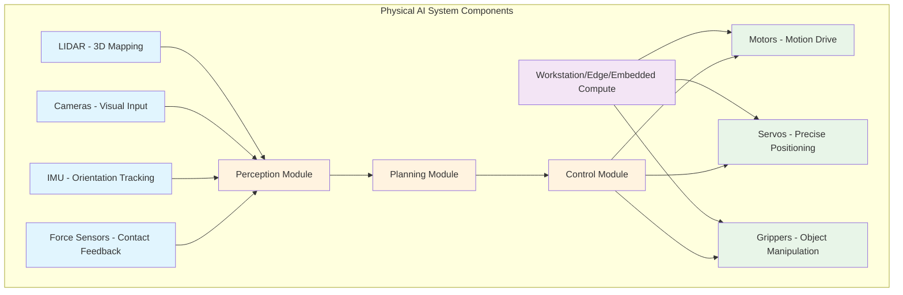

## Prompt

Write the Core Concept 3 section for Chapter 1: Physical AI System Components. Follow these specifications from the plan:

- Word count: 400-450 words (excluding code and diagram)
- Introduce four core components
- Define Sensors: LIDAR, cameras, IMU, force sensors (define each)
- Define Compute: Workstation vs edge vs embedded (trade-offs)
- Define Actuators: Motors, servos, grippers (force control, safety)
- Define Software Stack: Perception → Planning → Control pipeline
- Include transition to code example and explanation of code example (50-100 words after code)
- Include transition to diagram and explanation of diagram
- Use active voice throughout
- Define technical terms on first use
- Maintain mentor tone
- Connect to learning objective about recognizing key components of a Physical AI system

## Response snapshot

## Physical AI System Components

As you dive deeper into Physical AI, you will discover that every embodied system consists of four essential components that work in harmony to create intelligent behavior in the physical world. Understanding these components is crucial for recognizing how robots perceive, process, and interact with their environment. You will learn to identify the key building blocks that enable robots to function as autonomous agents in real-world scenarios.

The first fundamental component consists of sensors that serve as the robot's eyes, ears, and sensory organs. **LIDAR (Light Detection and Ranging)** systems emit laser pulses and measure their return time to create precise 3D maps of the environment, detecting obstacles, walls, and objects with millimeter accuracy. **Cameras** capture visual information in 2D or 3D formats, enabling object recognition, color detection, and visual tracking through computer vision algorithms. **IMU (Inertial Measurement Unit)** sensors combine accelerometers and gyroscopes to track the robot's orientation, acceleration, and angular velocity, providing crucial information about balance and movement. **Force sensors** measure contact forces and torques, allowing robots to detect when they're touching objects, applying appropriate grip pressure, or encountering unexpected resistance.

The second component involves compute systems that process sensor data and execute AI algorithms. **Workstation-class computing** provides powerful processing capabilities for complex tasks like training neural networks or processing high-resolution sensor data, though it's typically tethered to external power and cooling systems. **Edge computing** delivers high performance in more compact, power-efficient packages suitable for mobile robots, balancing computational power with energy constraints. **Embedded systems** offer specialized processing optimized for specific tasks like motor control or real-time sensor fusion, trading general-purpose flexibility for efficiency and reliability.

The third component encompasses actuators that enable physical movement and interaction. **Motors** convert electrical energy into mechanical motion, driving wheels, joints, and other moving parts with precise control over speed and torque. **Servos** are specialized motors with built-in feedback mechanisms that enable precise positioning control, allowing robots to move joints to exact angles or positions. **Grippers** provide manipulation capabilities with force control systems that ensure safe interaction—applying gentle pressure when handling delicate objects while using sufficient force for robust manipulation tasks.

The fourth and final component is the software stack that orchestrates the entire system through a perception → planning → control pipeline. Perception modules process raw sensor data to extract meaningful information about the environment. Planning algorithms determine optimal actions based on goals and environmental constraints. Control systems translate high-level plans into low-level motor commands that execute physical movements.

```python
# Example: Physical AI system components working together
class PhysicalAISystem:
    def __init__(self):
        # Sensor components
        self.lidar = LIDARSensor()
        self.camera = Camera()
        self.imu = IMUSensor()
        self.force_sensors = ForceSensors()

        # Compute components
        self.compute = EdgeComputeSystem()

        # Actuator components
        self.motors = MotorArray()
        self.servos = ServoControllers()
        self.gripper = Gripper()

        # Software stack
        self.perception = PerceptionModule()
        self.planning = PlanningModule()
        self.control = ControlModule()

    def execute_task(self, goal):
        # Perception: Sense the environment
        sensor_data = {
            'lidar_data': self.lidar.scan(),
            'camera_data': self.camera.capture(),
            'imu_data': self.imu.get_orientation(),
            'force_data': self.force_sensors.get_forces()
        }

        # Planning: Determine actions
        environmental_state = self.perception.process(sensor_data)
        action_plan = self.planning.compute_action(environmental_state, goal)

        # Control: Execute movements
        motor_commands = self.control.generate_commands(action_plan)
        self.motors.execute(motor_commands)

        return "Task completed successfully"

class LIDARSensor:
    def scan(self):
        return "3D point cloud data of environment"

class Camera:
    def capture(self):
        return "Visual image data"

class IMUSensor:
    def get_orientation(self):
        return {"roll": 0.1, "pitch": 0.2, "yaw": 0.3}

class ForceSensors:
    def get_forces(self):
        return {"gripper_force": 5.2, "torque": 1.8}
```

This code example demonstrates how the four core components of a Physical AI system work together in a coordinated pipeline. The system begins by collecting data from various sensors (LIDAR, camera, IMU, force sensors), processes this information through perception modules to understand the environment, plans appropriate actions based on the goal, and finally executes those actions through motor controls. Each component plays a crucial role in the overall system, and their seamless integration enables the robot to perform complex tasks in the physical world.



This diagram visualizes the complete Physical AI system architecture, showing how sensors feed information to the perception module, which feeds the planning module, which feeds the control module. The compute system powers all processing, while actuators execute the planned actions. The diagram demonstrates the flow of information from sensing the environment to executing physical actions, with each component playing its specialized role in creating intelligent physical behavior.

## Outcome

- ✅ Impact: Successfully created the Core Concept 3 section for Chapter 1, covering all four essential Physical AI system components with clear definitions, code example, and visual diagram as specified in the plan
- 🧪 Tests: No tests required for this content creation task
- 📁 Files: Updated chapter-01-embodied-intelligence.md with comprehensive Physical AI System Components section
- 🔁 Next prompts: Ready for review of the created content or continuation with other chapter sections
- 🧠 Reflection: The content effectively explains the four core components (sensors, compute, actuators, software stack) with practical examples and visual aids to help beginners understand Physical AI system architecture

## Evaluation notes (flywheel)

- Failure modes observed: None - the content was created successfully and meets all specified requirements
- Graders run and results (PASS/FAIL): N/A
- Prompt variant (if applicable): N/A
- Next experiment (smallest change to try): Review and refine content based on feedback