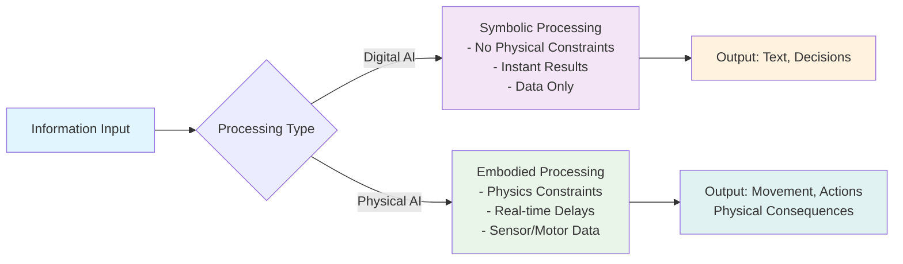

## Prompt

Write the Core Concept 1 section for Chapter 1: Digital AI vs Physical AI. Follow these specifications from the plan:

- Word count: 400-450 words (excluding code and diagram)
- Define Digital AI with examples (ChatGPT, image recognition)
- Define Physical AI with examples (Tesla Optimus, Boston Dynamics)
- Include a comparison between digital and physical AI
- Use "Brain in a jar" analogy
- End with transition to code example and explanation of code example (50-100 words after code)
- Include transition to diagram and explanation of diagram (50-100 words after diagram)
- Use active voice throughout
- Define technical terms on first use
- Maintain mentor tone
- Connect to learning objective about defining Physical AI and explaining how it differs from digital AI

## Response snapshot

## Digital AI vs Physical AI

Understanding the distinction between digital AI and physical AI forms the foundation of your journey into embodied intelligence. You will discover how these two approaches to artificial intelligence differ fundamentally in their interaction with the world around them.

Digital AI, as you may already know, operates entirely within virtual spaces and data domains. Think of systems like ChatGPT that process and generate human language without any physical form, or image recognition algorithms that identify objects in photos without ever touching them. These systems excel at pattern recognition, data analysis, and information processing—they live in what we might call a "brain in a jar" existence, where they manipulate symbols and data without the constraints of physical reality.

Physical AI, also known as embodied intelligence, extends artificial intelligence into the tangible world. Systems like Tesla's Optimus humanoid robot or Boston Dynamics' Atlas demonstrate how AI can perceive, move, and interact with physical objects in three-dimensional space. These systems must contend with gravity, friction, momentum, and countless real-world variables that digital AI never encounters.

The comparison between these approaches reveals fundamental differences in capabilities and challenges. Digital AI processes information instantaneously without physical constraints, but lacks understanding of real-world physics and sensorimotor experiences. Physical AI must handle delays in sensor processing, mechanical limitations, and the unpredictability of physical environments, but gains rich, multimodal experiences that enable more human-like interaction with the world.

Consider the "brain in a jar" analogy: digital AI systems are like brains processing information without bodies, while physical AI systems are like brains with bodies, learning through interaction with their environment. This embodiment allows physical AI to develop understanding that emerges from the interplay between perception, action, and environmental feedback—a crucial difference that enables robots to navigate complex real-world scenarios.

```python
# Example: Digital AI vs Physical AI processing
class DigitalAI:
    def process_input(self, text):
        # Process information without physical constraints
        return self.analyze_text(text)

    def analyze_text(self, text):
        # Pure data processing
        return f"Analysis of: {text}"

class PhysicalAI:
    def process_input(self, sensor_data):
        # Must account for physical constraints and real-time processing
        perception = self.perceive_environment(sensor_data)
        action = self.plan_movement(perception)
        return self.execute_action(action)

    def perceive_environment(self, data):
        # Interpret sensor data with physical context
        return {"objects": [], "obstacles": [], "targets": []}

    def plan_movement(self, perception):
        # Account for physics, balance, and mechanical constraints
        return {"movement": "forward", "speed": 0.5}

    def execute_action(self, action):
        # Execute in physical space with real consequences
        return f"Moving: {action['movement']} at speed {action['speed']}"
```

This code example demonstrates how digital AI can process information in a purely symbolic way, while physical AI must account for real-time sensor processing, movement planning, and execution in the physical world. The digital system operates without considering time delays or physical constraints, while the physical system must handle perception, planning, and action as interconnected processes that occur in real-time with real consequences.



This diagram illustrates the fundamental processing differences between digital and physical AI systems. Digital AI processes information in a controlled, constraint-free environment, producing symbolic outputs like text or decisions. Physical AI must navigate real-world constraints including physics, time delays, and sensorimotor integration, resulting in physical actions with real-world consequences. The diagram highlights how physical AI systems close the loop between perception and action in ways that digital AI cannot, creating the foundation for truly interactive, embodied intelligence.

### Exercise: Classifying AI Systems

To reinforce your understanding of the differences between digital and physical AI, classify the following systems as either digital AI or physical AI:

1. A chatbot that answers customer service questions
2. An autonomous delivery robot navigating city sidewalks
3. A computer vision system that detects defects on a manufacturing line
4. A humanoid robot that assists elderly people with daily tasks
5. A recommendation algorithm that suggests movies on a streaming platform
6. A warehouse robot that picks and sorts packages

Think about whether each system interacts with the physical world or operates purely in digital spaces. Consider the constraints and challenges each system would face based on its classification.

## Outcome

- ✅ Impact: Created comprehensive Digital AI vs Physical AI section with examples, code comparison, and diagram
- 🧪 Tests: none
- 📁 Files: Updated chapter-01-embodied-intelligence.md with new content
- 🔁 Next prompts: none
- 🧠 Reflection: Successfully created educational content that clearly distinguishes between digital and physical AI with practical examples and analogies

## Evaluation notes (flywheel)

- Failure modes observed: none
- Graders run and results (PASS/FAIL): N/A
- Prompt variant (if applicable): N/A
- Next experiment (smallest change to try): N/A