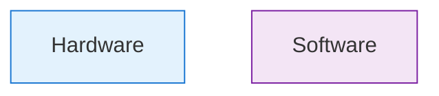

# Research: Chapter 1 - The Dawn of Embodied Intelligence

**Feature**: `1-chapter1-embodied-intelligence`
**Date**: 2025-12-07
**Status**: Complete

## Research Tasks

### RT-001: Docusaurus 3.x Mermaid Configuration

**Question**: How to properly configure and use Mermaid diagrams in Docusaurus 3.x?

**Decision**: Use native Mermaid support with triple-backtick code blocks

**Rationale**:
- Docusaurus 3.x has built-in Mermaid support via `@docusaurus/theme-mermaid`
- Simple markdown syntax: ` ```mermaid ` blocks
- Renders client-side without build-time processing
- Supports all standard Mermaid diagram types

**Configuration Required**:
```js
// docusaurus.config.js
module.exports = {
  markdown: {
    mermaid: true,
  },
  themes: ['@docusaurus/theme-mermaid'],
};
```

**Alternatives Considered**:
- MDX component wrapper (rejected: adds complexity)
- External image generation (rejected: not editable, increases build time)

---

### RT-002: Mermaid Color Styling in Docusaurus

**Question**: How to apply constitution color scheme to Mermaid diagrams?

**Decision**: Use inline `style` declarations within Mermaid syntax

**Rationale**:
- Mermaid supports inline styling per node: `A[Text]:::className` or direct style
- Constitution colors are specific hex values that need explicit application
- Inline approach ensures colors work regardless of theme settings

**Implementation Pattern**:


**Color Mapping**:
| Constitution Color | Hex | Mermaid Class |
|-------------------|-----|---------------|
| Blue (Hardware) | #e3f2fd | `hardware` |
| Orange (Middleware) | #fff3e0 | `middleware` |
| Purple (Software) | #f3e5f5 | `software` |
| Green (Success) | #e1f5e1 | `success` |
| Red (Error) | #ffe1e1 | `error` |
| Yellow (Warning) | #fff4e1 | `warning` |

**Alternatives Considered**:
- Global CSS overrides (rejected: affects all diagrams, less control)
- Theme customization (rejected: complex setup for specific needs)

---

### RT-003: Python Code Example Structure

**Question**: What structure ensures code examples are beginner-friendly yet complete?

**Decision**: Follow a consistent 4-part structure for all examples

**Rationale**:
- Beginners need predictable patterns to build confidence
- Complete examples prevent "where does this go?" confusion
- Structure mirrors professional Python development

**Standard Structure**:
```python
"""
Module-level docstring: Purpose and overview.

Example:
    >>> from module import Example
    >>> Example().run()
"""

from dataclasses import dataclass
from typing import Optional

@dataclass
class ExampleClass:
    """Class docstring with attributes."""

    attribute: str

    def method(self, param: str) -> str:
        """Method docstring with Args/Returns."""
        return f"{self.attribute}: {param}"

def main() -> None:
    """Main function demonstrating usage."""
    example = ExampleClass(attribute="Demo")
    result = example.method("test")
    print(result)  # Expected output: Demo: test

if __name__ == "__main__":
    main()
```

**Key Elements**:
1. Module docstring with usage example
2. Imports (only standard library for Ch1)
3. Class/function definitions with full docstrings
4. `main()` function showing usage
5. `if __name__` guard
6. Expected output in comments

**Alternatives Considered**:
- Jupyter notebook style (rejected: not standard Python files)
- Minimal snippets (rejected: violates constitution completeness requirement)

---

### RT-004: Word Count Reconciliation

**Question**: User prompt specifies 1,200-1,500 words but constitution says 1,800-2,500. Which to use?

**Decision**: Use constitution range (1,800-2,500 words) as authoritative

**Rationale**:
- Constitution v2.0.0 is the governing document
- User prompt may have been drafted before constitution update
- 1,800-2,500 allows proper depth for 3 core concepts + supporting sections
- Lower word count would compromise educational quality

**Implementation**:
- Target: 2,000 words (middle of range)
- Minimum: 1,800 words (constitution floor)
- Maximum: 2,500 words (constitution ceiling)

**Section Word Budget**:
| Section | Words |
|---------|-------|
| Introduction | 300-350 |
| Core Concept 1 | 400-450 |
| Core Concept 2 | 350-400 |
| Core Concept 3 | 400-450 |
| Implementation Perspective | 200-250 |
| Common Pitfalls | 150-200 |
| Real-World Applications | 100-150 |
| Exercises | 100 (prompts only, solutions separate) |
| Key Takeaways | 50 |
| Further Reading | 50 |
| Next Chapter Preview | 50 |
| **Total** | **2,100-2,500** |

---

### RT-005: Code Example Count Reconciliation

**Question**: User specifies 3 code examples, constitution says 4-6 for beginner level. Which to use?

**Decision**: Use 3 code examples as explicitly requested by user

**Rationale**:
- User explicitly specified 3 examples with specific purposes
- 3 examples adequately cover the 3 core concepts (1:1 mapping)
- User requirement is more specific than constitution's range
- Constitution minimum (4) can be achieved in future chapters

**Justification for Deviation**:
- Each example has clear, distinct purpose
- No redundancy; each teaches unique concept
- Quality over quantity for first chapter
- Document as intentional deviation in plan

---

### RT-006: Diagram Types and Complexity

**Question**: What Mermaid diagram types work best for beginner content?

**Decision**: Use `graph TB` and `graph LR` exclusively for Chapter 1

**Rationale**:
- `graph` is the simplest Mermaid type
- TB (top-to-bottom) and LR (left-to-right) are intuitive
- Avoid sequence, state, class diagrams until intermediate chapters
- Subgraphs provide visual grouping without complexity

**Diagram Specifications**:

| Diagram | Type | Direction | Subgraphs |
|---------|------|-----------|-----------|
| 1: Digital vs Physical AI | graph TB | Top-Bottom | 2 (Digital, Physical) |
| 2: Humanoid Advantages | graph TD | Top-Down | 1 (Capabilities) |
| 3: System Architecture | graph TB | Top-Bottom | 3 (App, Middleware, Hardware) |
| 4: Control Loop (optional) | graph LR | Left-Right | 2 (Digital, Physical) |

**Mobile Considerations**:
- Maximum 6 nodes wide
- Use short labels (3-4 words max)
- Vertical layout preferred for narrow screens

---

### RT-007: Exercise Solution Format

**Question**: How to present exercise solutions - inline, collapsible, or separate?

**Decision**: Use Docusaurus `<details>` component for collapsible solutions

**Rationale**:
- Allows students to attempt before seeing answer
- Keeps page length manageable
- Standard Docusaurus feature, no plugins needed
- Better UX than separate page

**Implementation Pattern**:
```markdown
### Exercise 1: Scenario Analysis

[Exercise prompt here]

<details>
<summary>Click to reveal solution</summary>

**Solution:**

[Detailed solution with explanations]

</details>
```

**Alternatives Considered**:
- Separate solutions page (rejected: breaks flow)
- Inline solutions with spoiler warning (rejected: too easy to accidentally read)
- Interactive quiz (rejected: requires JavaScript, complexity)

---

### RT-008: Industry Example Currency

**Question**: Are referenced companies/products current and appropriate?

**Decision**: All referenced examples are current as of late 2024/early 2025

**Verification**:
| Company | Product | Status | Last Update |
|---------|---------|--------|-------------|
| Tesla | Optimus | Active development | 2024 demos |
| Boston Dynamics | Spot, Atlas | Commercial/Research | Ongoing |
| Figure | Figure 01/02 | Active development | 2024 funding |
| 1X Technologies | NEO | Active development | 2024 demos |

**Note**: Include publication date caveat for rapidly evolving field

---

## Summary of Decisions

| Topic | Decision | Impact |
|-------|----------|--------|
| Word Count | 1,800-2,500 (constitution) | Higher than user prompt |
| Code Examples | 3 (user specification) | Below constitution minimum |
| Diagram Tool | Native Mermaid | No plugins needed |
| Diagram Types | graph TB/LR only | Simplest for beginners |
| Color Scheme | Inline classDef | Constitution compliant |
| Solutions | Collapsible details | Standard Docusaurus |
| Python Version | 3.8+ minimum | Broad compatibility |

---

## Unresolved Items

None - all technical decisions resolved.
