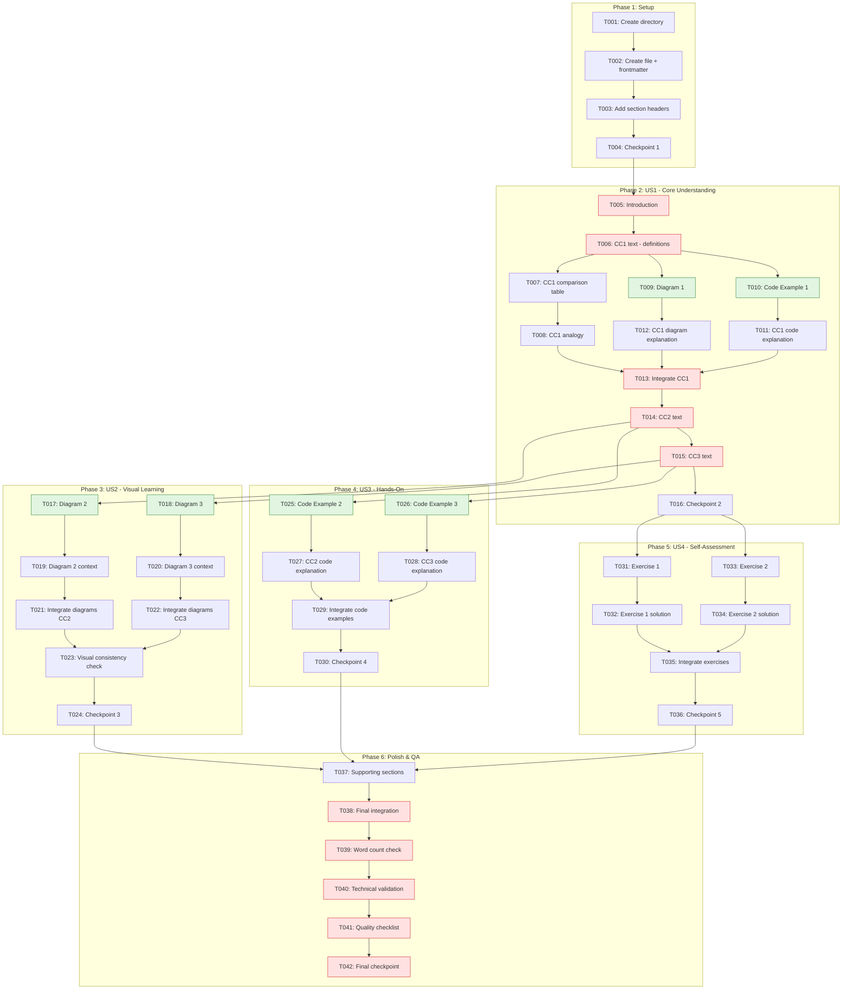

# Task Breakdown: Chapter 1 - The Dawn of Embodied Intelligence

**Feature**: `1-chapter1-embodied-intelligence`
**Generated**: 2025-12-07
**Plan**: [plan.md](./plan.md)
**Spec**: [spec.md](./spec.md)

---

## Task Summary

| Metric | Value |
|--------|-------|
| **Total Tasks** | 42 |
| **Estimated Time** | 95-115 minutes |
| **Critical Path Duration** | ~70 minutes |
| **Parallel Opportunities** | 12 tasks (code + diagrams) |

### Tasks by Agent

| Agent | Tasks | Est. Time |
|-------|-------|-----------|
| Orchestrator | 8 | 20 min |
| Content-Writer | 22 | 50 min |
| Code-Architect | 6 | 20 min |
| Diagram-Designer | 6 | 18 min |

### Tasks by Phase

| Phase | Tasks | Est. Time |
|-------|-------|-----------|
| Phase 1: Setup | 4 | 8 min |
| Phase 2: US1 - Core Understanding | 12 | 35 min |
| Phase 3: US2 - Visual Learning | 8 | 20 min |
| Phase 4: US3 - Hands-On Learning | 6 | 15 min |
| Phase 5: US4 - Self-Assessment | 6 | 15 min |
| Phase 6: Polish & QA | 6 | 17 min |

---

## Dependency Graph



**Legend**:
- 🔴 Red: Critical path tasks
- 🟢 Green: Parallelizable tasks

---

## Phase 1: Setup

**Goal**: Create chapter file structure ready for content

### Tasks

- [ ] T001 Create directory structure at `docusaurus-course-book/docs/part-1-foundations/`

**Agent**: Orchestrator

**Action**: Create the directory if it doesn't exist using mkdir -p

**Output**: Directory `docusaurus-course-book/docs/part-1-foundations/` exists

**Dependencies**: None

**Parallel**: No

**Validation**: `ls docusaurus-course-book/docs/part-1-foundations/` succeeds

**Estimated Time**: 1 min

---

- [ ] T002 Create chapter file with frontmatter at `docusaurus-course-book/docs/part-1-foundations/chapter-01-embodied-intelligence.md`

**Agent**: Orchestrator

**Action**: Create markdown file with YAML frontmatter containing sidebar_position: 1 and title

**Output**: File with correct frontmatter

**Dependencies**: T001

**Parallel**: No

**Validation**: File exists, frontmatter parses correctly

**Estimated Time**: 2 min

---

- [ ] T003 Add all 11 section headers to `docusaurus-course-book/docs/part-1-foundations/chapter-01-embodied-intelligence.md`

**Agent**: Orchestrator

**Action**: Add chapter title (H1), overview box, and all section headers (H2) with placeholders

**Output**: Complete section structure with placeholders

**Dependencies**: T002

**Parallel**: No

**Validation**: All 11 sections present per data-model.md

**Estimated Time**: 3 min

---

- [ ] T004 [CHECKPOINT] Verify structure matches constitution at `docusaurus-course-book/docs/part-1-foundations/chapter-01-embodied-intelligence.md`

**Agent**: Orchestrator

**Action**: Validate file exists, frontmatter correct, all sections present, file loads in Docusaurus

**Output**: Checkpoint report confirming Phase 1 complete

**Dependencies**: T003

**Parallel**: No

**Validation Checklist**:
- [ ] File exists at correct path
- [ ] Frontmatter parses correctly
- [ ] All 11 sections present
- [ ] Docusaurus builds without errors

**Estimated Time**: 2 min

---

## Phase 2: User Story 1 - First-Time Reader Introduction (P1)

**Goal**: Reader understands digital vs physical AI distinction

**Independent Test**: Reader can explain why a robot picking up a cup differs from ChatGPT answering questions

### Tasks

- [ ] T005 [US1] Write introduction section (300-350 words) in `chapter-01-embodied-intelligence.md`

**Agent**: Content-Writer

**Action**: Write introduction with opening hook ("Imagine..."), context about shift to physical AI, preview of 3 concepts, course connection

**Output**: Introduction section replacing placeholder

**Dependencies**: T004

**Parallel**: No (critical path)

**Validation**:
- Word count 300-350
- Starts with "Imagine..."
- Previews 3 core concepts
- Ends with "In this chapter, you will learn..."

**Estimated Time**: 8 min

---

- [ ] T006 [US1] Write Core Concept 1 definitions (Digital AI and Physical AI) in `chapter-01-embodied-intelligence.md`

**Agent**: Content-Writer

**Action**: Define Digital AI (chatbots, image recognition, LLMs) and Physical AI (Tesla Optimus, Boston Dynamics) with examples

**Output**: Definition paragraphs in Core Concept 1 section

**Dependencies**: T005

**Parallel**: No (critical path)

**Validation**:
- Digital AI defined with 3+ examples
- Physical AI defined with 2+ examples
- No jargon without explanation

**Estimated Time**: 5 min

---

- [ ] T007 [US1] Write comparison table for Digital vs Physical AI in `chapter-01-embodied-intelligence.md`

**Agent**: Content-Writer

**Action**: Create markdown table comparing Input/Output, Constraints, Environment, Consequences

**Output**: Comparison table in Core Concept 1 section

**Dependencies**: T006

**Parallel**: No

**Validation**: 4 comparison dimensions included per FR-002.3

**Estimated Time**: 3 min

---

- [ ] T008 [US1] Write "brain in a jar" analogy in `chapter-01-embodied-intelligence.md`

**Agent**: Content-Writer

**Action**: Write relatable analogy explaining embodiment concept

**Output**: Analogy paragraph in Core Concept 1 section

**Dependencies**: T007

**Parallel**: No

**Validation**: Analogy is relatable and explains embodiment clearly

**Estimated Time**: 3 min

---

- [ ] T009 [P] [US1] Create Diagram 1: Digital AI vs Physical AI Architecture

**Agent**: Diagram-Designer

**Action**: Create Mermaid graph TB with two subgraphs showing Digital AI (User→LLM→Response) and Physical AI (Environment→Sensors→Perception→Planning→Control→Actuators→Environment loop)

**Output**: Mermaid code block for Diagram 1

**Dependencies**: T006 (for context)

**Parallel**: Yes, with T010

**Validation**:
- Uses graph TB
- Has 2 subgraphs
- Uses constitution colors (Orange for software, Blue for hardware)
- Mobile-friendly (max 6 nodes wide)

**Estimated Time**: 5 min

---

- [ ] T010 [P] [US1] Create Code Example 1: Simple Chatbot (30-40 lines)

**Agent**: Code-Architect

**Action**: Create SimpleChatbot class with responses dict, respond() method, main() demo. Include all docstrings, type hints, expected output.

**Output**: Complete Python code block for Example 1

**Dependencies**: T006 (for context)

**Parallel**: Yes, with T009

**Validation**:
- 30-40 lines
- Module docstring present
- Class and method docstrings (Google style)
- Type hints on all functions
- `if __name__ == "__main__":` guard
- Expected output comment
- Runs with Python 3.8+

**Estimated Time**: 8 min

---

- [ ] T011 [US1] Write explanation for Code Example 1 (50-100 words) in `chapter-01-embodied-intelligence.md`

**Agent**: Content-Writer

**Action**: Write paragraph explaining what the code demonstrates (text in, text out simplicity)

**Output**: Code explanation paragraph after Example 1

**Dependencies**: T010

**Parallel**: No

**Validation**: Explains digital AI simplicity, 50-100 words

**Estimated Time**: 3 min

---

- [ ] T012 [US1] Write context + caption + explanation for Diagram 1 in `chapter-01-embodied-intelligence.md`

**Agent**: Content-Writer

**Action**: Write context paragraph before diagram, caption ("Figure 1: ..."), explanation paragraph after

**Output**: Diagram 1 framing text

**Dependencies**: T009

**Parallel**: No

**Validation**:
- Context paragraph present before diagram
- Caption in format "Figure 1: ..."
- Explanation paragraph highlights key differences

**Estimated Time**: 3 min

---

- [ ] T013 [US1] Integrate Diagram 1 and Code Example 1 into Core Concept 1 section

**Agent**: Orchestrator

**Action**: Place diagram and code in correct positions with transitions between text, diagram, and code

**Output**: Complete Core Concept 1 section

**Dependencies**: T008, T011, T012

**Parallel**: No (critical path)

**Validation**: Section flows logically: definitions → table → analogy → diagram → code

**Estimated Time**: 3 min

---

- [ ] T014 [US1] Write Core Concept 2: Why Humanoid Robots? (350-400 words) in `chapter-01-embodied-intelligence.md`

**Agent**: Content-Writer

**Action**: Write human-centered world argument, 4 form factor advantages, industry examples (Tesla, Figure, 1X), alternative form factors mention

**Output**: Core Concept 2 text content (excluding diagram/code placeholders)

**Dependencies**: T013

**Parallel**: No (critical path)

**Validation**:
- Human-centered world argument present
- 4 advantages listed per FR-003.2
- 3 industry examples per FR-003.3
- Alternative form factors mentioned

**Estimated Time**: 6 min

---

- [ ] T015 [US1] Write Core Concept 3: Physical AI System Components (400-450 words) in `chapter-01-embodied-intelligence.md`

**Agent**: Content-Writer

**Action**: Write 4 components (Sensors, Compute, Actuators, Software Stack) with definitions and examples per plan.md Phase 2.4

**Output**: Core Concept 3 text content (excluding diagram/code placeholders)

**Dependencies**: T014

**Parallel**: No (critical path)

**Validation**:
- All 4 components explained per FR-004.1-4
- LIDAR, cameras, IMU defined
- Software stack pipeline explained
- Word count 400-450

**Estimated Time**: 8 min

---

- [ ] T016 [CHECKPOINT] [US1] Verify core text content complete

**Agent**: Orchestrator

**Action**: Validate all text for core concepts is written, word count on track

**Output**: Checkpoint report for US1 text completion

**Dependencies**: T015

**Parallel**: No

**Validation Checklist**:
- [ ] Introduction: 300-350 words
- [ ] Core Concept 1: text complete
- [ ] Core Concept 2: text complete
- [ ] Core Concept 3: text complete
- [ ] Running word count ~1,400-1,600

**Estimated Time**: 2 min

---

## Phase 3: User Story 2 - Visual Learner Comprehension (P1)

**Goal**: Diagrams reinforce and clarify concepts

**Independent Test**: Reader can explain Physical AI architecture from Diagram 3 alone

### Tasks

- [ ] T017 [P] [US2] Create Diagram 2: Humanoid Form Factor Advantages

**Agent**: Diagram-Designer

**Action**: Create Mermaid graph TD with Humanoid Robot central node, capability nodes (Vision, Manipulation, Mobility, Interaction), advantage nodes (stairs, tools, spaces, communication)

**Output**: Mermaid code block for Diagram 2

**Dependencies**: T014 (for context)

**Parallel**: Yes, with T018

**Validation**:
- Uses graph TD
- Central humanoid node
- Blue (#e3f2fd) for capabilities
- Purple (#f3e5f5) for advantages
- Mobile-friendly width

**Estimated Time**: 5 min

---

- [ ] T018 [P] [US2] Create Diagram 3: Physical AI System Architecture

**Agent**: Diagram-Designer

**Action**: Create Mermaid graph TB with 3 subgraphs (Application, Middleware, Hardware layers), data flow arrows between layers

**Output**: Mermaid code block for Diagram 3

**Dependencies**: T015 (for context)

**Parallel**: Yes, with T017

**Validation**:
- Uses graph TB
- 3 layer subgraphs
- Purple (#f3e5f5) Application, Orange (#fff3e0) Middleware, Blue (#e3f2fd) Hardware
- Data flow arrows correct
- Mobile-friendly

**Estimated Time**: 6 min

---

- [ ] T019 [US2] Write context + caption + explanation for Diagram 2 in `chapter-01-embodied-intelligence.md`

**Agent**: Content-Writer

**Action**: Write context paragraph, caption ("Figure 2: ..."), explanation connecting to human-centered world argument

**Output**: Diagram 2 framing text

**Dependencies**: T017

**Parallel**: No

**Validation**: All 3 elements present per DG-003, DG-004

**Estimated Time**: 3 min

---

- [ ] T020 [US2] Write context + caption + explanation for Diagram 3 in `chapter-01-embodied-intelligence.md`

**Agent**: Content-Writer

**Action**: Write context paragraph, caption ("Figure 3: ..."), explanation of data flow through system

**Output**: Diagram 3 framing text

**Dependencies**: T018

**Parallel**: No

**Validation**: All 3 elements present, explains data flow clearly

**Estimated Time**: 3 min

---

- [ ] T021 [US2] Integrate Diagram 2 into Core Concept 2 section

**Agent**: Orchestrator

**Action**: Place diagram with context/caption/explanation in correct position within section

**Output**: Core Concept 2 with integrated diagram

**Dependencies**: T019

**Parallel**: No

**Validation**: Diagram positioned after form factor advantages text

**Estimated Time**: 2 min

---

- [ ] T022 [US2] Integrate Diagram 3 into Core Concept 3 section

**Agent**: Orchestrator

**Action**: Place diagram with context/caption/explanation in correct position within section

**Output**: Core Concept 3 with integrated diagram

**Dependencies**: T020

**Parallel**: No

**Validation**: Diagram positioned after software stack explanation

**Estimated Time**: 2 min

---

- [ ] T023 [US2] Verify visual consistency across all diagrams

**Agent**: Orchestrator

**Action**: Check color scheme consistency, labeling style, mobile-friendliness across Diagrams 1-3

**Output**: Visual consistency report

**Dependencies**: T021, T022

**Parallel**: No

**Validation**:
- [ ] All diagrams use constitution colors
- [ ] Blue consistently represents hardware
- [ ] Labels max 4 words
- [ ] All render correctly in preview

**Estimated Time**: 2 min

---

- [ ] T024 [CHECKPOINT] [US2] Verify all diagrams integrated

**Agent**: Orchestrator

**Action**: Confirm 3 diagrams present with proper context/caption/explanation

**Output**: Checkpoint report for US2 completion

**Dependencies**: T023

**Parallel**: No

**Validation Checklist**:
- [ ] Diagram 1 integrated in CC1
- [ ] Diagram 2 integrated in CC2
- [ ] Diagram 3 integrated in CC3
- [ ] All render correctly
- [ ] Color scheme consistent

**Estimated Time**: 2 min

---

## Phase 4: User Story 3 - Hands-On Learner Engagement (P2)

**Goal**: All code examples run and teach concepts

**Independent Test**: All 3 examples run with Python 3.8+ producing expected output

### Tasks

- [ ] T025 [P] [US3] Create Code Example 2: Robot State Representation (40-50 lines)

**Agent**: Code-Architect

**Action**: Create RobotState dataclass with position, orientation, joint_angles, battery_level. Add update_position() and is_safe_state() methods. Include main() demo.

**Output**: Complete Python code block for Example 2

**Dependencies**: T014 (for context)

**Parallel**: Yes, with T026

**Validation**:
- 40-50 lines
- Uses dataclass decorator
- All fields with type hints
- Both methods with docstrings
- main() shows state changes
- Expected output comment

**Estimated Time**: 8 min

---

- [ ] T026 [P] [US3] Create Code Example 3: Sensor Data Structure (30-40 lines)

**Agent**: Code-Architect

**Action**: Create SensorReading dataclass with timestamp, camera_data, lidar_points, imu_data. Add get_closest_obstacle() method. Include main() creating sample reading.

**Output**: Complete Python code block for Example 3

**Dependencies**: T015 (for context)

**Parallel**: Yes, with T025

**Validation**:
- 30-40 lines
- Uses dataclass decorator
- Multiple sensor types represented
- get_closest_obstacle() method
- main() with sample data
- Expected output comment

**Estimated Time**: 7 min

---

- [ ] T027 [US3] Write explanation for Code Example 2 (50-100 words) in `chapter-01-embodied-intelligence.md`

**Agent**: Content-Writer

**Action**: Write paragraph explaining physical state tracking concept that digital AI doesn't need

**Output**: Code explanation paragraph after Example 2

**Dependencies**: T025

**Parallel**: No

**Validation**: Explains state tracking necessity, 50-100 words

**Estimated Time**: 3 min

---

- [ ] T028 [US3] Write explanation for Code Example 3 (50-100 words) in `chapter-01-embodied-intelligence.md`

**Agent**: Content-Writer

**Action**: Write paragraph explaining sensor data complexity vs simple text input

**Output**: Code explanation paragraph after Example 3

**Dependencies**: T026

**Parallel**: No

**Validation**: Contrasts with digital AI inputs, 50-100 words

**Estimated Time**: 3 min

---

- [ ] T029 [US3] Integrate Code Examples 2 and 3 into their sections

**Agent**: Orchestrator

**Action**: Place examples with explanations in Core Concepts 2 and 3, verify transitions

**Output**: Sections with integrated code examples

**Dependencies**: T027, T028

**Parallel**: No

**Validation**: Code positioned after diagram in each section

**Estimated Time**: 3 min

---

- [ ] T030 [CHECKPOINT] [US3] Verify all code examples complete and runnable

**Agent**: Orchestrator

**Action**: Test all 3 examples run with Python 3.8+, verify documentation complete

**Output**: Checkpoint report with test results

**Dependencies**: T029

**Parallel**: No

**Validation Checklist**:
- [ ] Example 1: Runs, produces expected output
- [ ] Example 2: Runs, produces expected output
- [ ] Example 3: Runs, produces expected output
- [ ] All have docstrings and type hints
- [ ] No external dependencies

**Estimated Time**: 3 min

---

## Phase 5: User Story 4 - Self-Assessment Learner (P2)

**Goal**: Exercises validate learning objective achievement

**Independent Test**: Reader achieves 80%+ on exercises without re-reading

### Tasks

- [ ] T031 [US4] Create Exercise 1: Scenario Analysis in `chapter-01-embodied-intelligence.md`

**Agent**: Content-Writer

**Action**: Create 5 scenarios asking reader to identify Digital vs Physical AI requirement per FR-008.1

**Output**: Exercise 1 prompt with 5 scenarios

**Dependencies**: T016 (core content complete)

**Parallel**: No

**Validation**: 5 scenarios per FR-008.1, clear instructions

**Estimated Time**: 4 min

---

- [ ] T032 [US4] Write complete solution for Exercise 1 (collapsible)

**Agent**: Content-Writer

**Action**: Write solution with reasoning for each scenario using `<details>` tag per research.md RT-007

**Output**: Collapsible solution block

**Dependencies**: T031

**Parallel**: No

**Validation**:
- Uses `<details>` tag
- Step-by-step reasoning for each
- Key concepts highlighted
- Common mistakes addressed

**Estimated Time**: 5 min

---

- [ ] T033 [US4] Create Exercise 2: Component Identification in `chapter-01-embodied-intelligence.md`

**Agent**: Content-Writer

**Action**: Present "pick up a cup" task, ask reader to identify sensors, actuators, planning per FR-008.3-4

**Output**: Exercise 2 prompt

**Dependencies**: T016 (core content complete)

**Parallel**: No

**Validation**: Clear task, asks for all 3 component types

**Estimated Time**: 3 min

---

- [ ] T034 [US4] Write complete solution for Exercise 2 (collapsible)

**Agent**: Content-Writer

**Action**: Write detailed breakdown with explanations using `<details>` tag

**Output**: Collapsible solution block

**Dependencies**: T033

**Parallel**: No

**Validation**:
- Uses `<details>` tag
- Complete breakdown of sensors needed
- Complete breakdown of actuators needed
- Planning requirements explained
- References Diagram 3

**Estimated Time**: 5 min

---

- [ ] T035 [US4] Integrate exercises into Conceptual Exercises section

**Agent**: Orchestrator

**Action**: Place both exercises with solutions in section, add intro text

**Output**: Complete Exercises section

**Dependencies**: T032, T034

**Parallel**: No

**Validation**: Both exercises with collapsible solutions present

**Estimated Time**: 2 min

---

- [ ] T036 [CHECKPOINT] [US4] Verify exercises test learning objectives

**Agent**: Orchestrator

**Action**: Map each exercise to learning objectives it tests

**Output**: LO coverage report

**Dependencies**: T035

**Parallel**: No

**Validation Checklist**:
- [ ] Exercise 1 tests LO-001 (Digital vs Physical AI)
- [ ] Exercise 1 tests LO-002 (Scenario identification)
- [ ] Exercise 2 tests LO-004 (System components)
- [ ] Solutions are complete and educational

**Estimated Time**: 2 min

---

## Phase 6: Polish & Quality Assurance

**Goal**: Chapter meets all quality criteria and is deployment-ready

### Tasks

- [ ] T037 Write supporting sections in `chapter-01-embodied-intelligence.md`

**Agent**: Content-Writer

**Action**: Write Implementation Perspective (200-250 words), Common Pitfalls table (3 rows), Real-World Applications (100-150 words), Key Takeaways (5 bullets), Further Reading (4 links), Next Chapter Preview (2-3 sentences)

**Output**: All supporting sections complete

**Dependencies**: T024, T030, T036

**Parallel**: No

**Validation**:
- Implementation Perspective: 200-250 words, compares challenges
- Common Pitfalls: 3-row table per FR-006
- Real-World Applications: current + emerging + timeline
- Key Takeaways: 5 bullets per FR-009
- Further Reading: 4 links per FR-010
- Next Chapter Preview: teases Chapter 2

**Estimated Time**: 12 min

---

- [ ] T038 Final integration and transition polish in `chapter-01-embodied-intelligence.md`

**Agent**: Orchestrator

**Action**: Review all sections flow together, add transition sentences between major sections, verify internal cross-references

**Output**: Polished, integrated chapter

**Dependencies**: T037

**Parallel**: No (critical path)

**Validation**: Smooth flow between all sections

**Estimated Time**: 5 min

---

- [ ] T039 Validate word count (1,800-2,500) for `chapter-01-embodied-intelligence.md`

**Agent**: Orchestrator

**Action**: Count words excluding code and diagrams, adjust if needed

**Output**: Word count report, adjustments if necessary

**Dependencies**: T038

**Parallel**: No (critical path)

**Validation**: Word count in range [1800, 2500] per SC-001

**Estimated Time**: 3 min

---

- [ ] T040 Technical validation: code syntax, diagram rendering

**Agent**: Orchestrator

**Action**: Verify all code blocks have syntax highlighting, all Mermaid diagrams render

**Output**: Technical validation report

**Dependencies**: T039

**Parallel**: No (critical path)

**Validation**:
- [ ] All Python blocks render with highlighting
- [ ] All 3 Mermaid diagrams render
- [ ] No markdown parsing errors

**Estimated Time**: 3 min

---

- [ ] T041 Run constitution quality checklist

**Agent**: Orchestrator

**Action**: Validate against all QG gates and SC criteria from spec.md

**Output**: Quality checklist report

**Dependencies**: T040

**Parallel**: No (critical path)

**Validation**:
- [ ] QG-001: No passive voice
- [ ] QG-002: Sentence length under 20 avg
- [ ] QG-003: No unexplained jargon
- [ ] QG-004: No robotics assumptions
- [ ] QG-005: Beginner-friendly tone
- [ ] SC-001 through SC-010 all pass

**Estimated Time**: 5 min

---

- [ ] T042 [FINAL CHECKPOINT] Chapter ready for deployment

**Agent**: Orchestrator

**Action**: Final review, confirm all success criteria met, report completion

**Output**: Final completion report

**Dependencies**: T041

**Parallel**: No

**Final Validation Checklist**:
- [ ] File at `docs/part-1-foundations/chapter-01-embodied-intelligence.md`
- [ ] Frontmatter correct (sidebar_position: 1, title)
- [ ] Word count: 1,800-2,500
- [ ] Code examples: 3 complete, runnable
- [ ] Diagrams: 3 rendering correctly
- [ ] Exercises: 2 with solutions
- [ ] All 5 learning objectives addressed
- [ ] Docusaurus builds without errors
- [ ] Mobile view readable
- [ ] Ready for Chapter 2

**Estimated Time**: 3 min

---

## Agent Assignment Summary

### Orchestrator (8 tasks, ~20 min)

| Task | Description |
|------|-------------|
| T001 | Create directory structure |
| T002 | Create file with frontmatter |
| T003 | Add section headers |
| T004 | Checkpoint 1: Structure |
| T013 | Integrate CC1 |
| T021 | Integrate Diagram 2 |
| T022 | Integrate Diagram 3 |
| T023 | Visual consistency check |
| T024 | Checkpoint 2: Diagrams |
| T029 | Integrate code examples |
| T030 | Checkpoint 3: Code |
| T035 | Integrate exercises |
| T036 | Checkpoint 4: Exercises |
| T038 | Final integration |
| T039 | Word count validation |
| T040 | Technical validation |
| T041 | Quality checklist |
| T042 | Final checkpoint |

### Content-Writer (22 tasks, ~50 min)

| Task | Description |
|------|-------------|
| T005 | Introduction |
| T006 | CC1 definitions |
| T007 | CC1 comparison table |
| T008 | CC1 analogy |
| T011 | CC1 code explanation |
| T012 | CC1 diagram context |
| T014 | CC2 text |
| T015 | CC3 text |
| T019 | Diagram 2 context |
| T020 | Diagram 3 context |
| T027 | CC2 code explanation |
| T028 | CC3 code explanation |
| T031 | Exercise 1 prompt |
| T032 | Exercise 1 solution |
| T033 | Exercise 2 prompt |
| T034 | Exercise 2 solution |
| T037 | Supporting sections |

### Code-Architect (6 tasks, ~20 min)

| Task | Description |
|------|-------------|
| T010 | Code Example 1: Chatbot |
| T025 | Code Example 2: Robot State |
| T026 | Code Example 3: Sensor Data |

### Diagram-Designer (6 tasks, ~18 min)

| Task | Description |
|------|-------------|
| T009 | Diagram 1: Digital vs Physical |
| T017 | Diagram 2: Humanoid Advantages |
| T018 | Diagram 3: System Architecture |

---

## Parallel Execution Strategy

### Parallel Group 1 (after T006)
```
Content-Writer: T007, T008 (sequential)
Code-Architect: T010 (parallel)
Diagram-Designer: T009 (parallel)
```

### Parallel Group 2 (after T014, T015)
```
Diagram-Designer: T017, T018 (parallel with each other)
Code-Architect: T025, T026 (parallel with each other and diagrams)
```

### Execution Timeline (Critical Path)

```
0-8 min:   T001-T004 (Setup)
8-16 min:  T005 (Introduction)
16-30 min: T006-T008 (CC1 text) + T009, T010 (parallel)
30-36 min: T011-T013 (CC1 integration)
36-50 min: T014-T015 (CC2, CC3 text) + T017, T018, T025, T026 (parallel)
50-60 min: T019-T024 (Diagram integration)
60-70 min: T027-T030 (Code integration)
70-85 min: T031-T036 (Exercises)
85-100 min: T037-T042 (Polish & QA)
```

**Total: ~100 minutes** (with parallel execution)

---

## Implementation Strategy

### MVP Scope (User Story 1 Only)
If constrained, complete only Phase 1 + Phase 2 for a minimal viable chapter that teaches the core Digital vs Physical AI distinction.

### Incremental Delivery
1. **Increment 1**: Setup + US1 text + Diagram 1 + Code Example 1
2. **Increment 2**: Add US2 (remaining diagrams)
3. **Increment 3**: Add US3 (remaining code examples)
4. **Increment 4**: Add US4 (exercises)
5. **Increment 5**: Polish + QA

### Quality Gates Between Phases
- No phase begins until previous checkpoint passes
- Critical path tasks cannot be delayed
- Parallel tasks have no cross-dependencies

---

## Success Criteria

The task breakdown is complete when:
- ✅ Every action from plan.md has corresponding task(s)
- ✅ All dependencies clearly specified
- ✅ 12 parallel opportunities identified
- ✅ Each task has validation criteria
- ✅ Agent assignments clear
- ✅ Time estimates reasonable (95-115 min total)
- ✅ 6 checkpoints included
- ✅ Critical path identified
- ✅ Orchestrator can execute tasks in order without ambiguity
