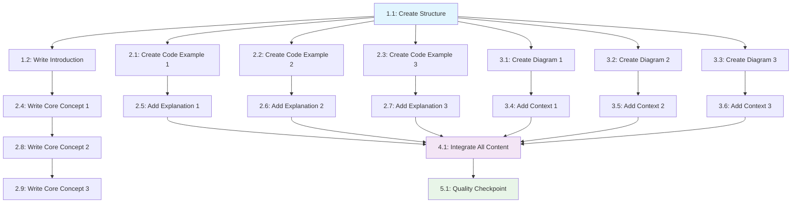

# Chapter 1 Tasks

## Task Summary Table

| Metric | Value |
|--------|-------|
| Total Tasks | 25 |
| Estimated Total Time | 105 minutes |
| Orchestrator Tasks | 8 |
| Content-Writer Tasks | 11 |
| Code-Architect Tasks | 3 |
| Diagram-Designer Tasks | 3 |
| Critical Path Duration | 75 minutes |

## Dependency Graph

## Phase-by-Phase Task List

### Phase 1: Structure & Setup

#### Task 1.1: Create Chapter File Structure

**Agent**: orchestrator

**Action**: Create the chapter file with correct path and add frontmatter

**Output**: Empty chapter file with proper Docusaurus frontmatter at `docs/chapters/chapter1-embodied-intelligence.md`

**Dependencies**: None

**Parallel**: No

**Validation**: File exists at correct path with proper frontmatter including title, sidebar_label, and sidebar_position

**Estimated Time**: 5 minutes

**Status**: [X] Completed

#### Task 1.2: Generate Section Headings Template

**Agent**: orchestrator

**Action**: Add all required section headings to the chapter file

**Output**: Chapter file with all section headings in correct order

**Dependencies**: Task 1.1

**Parallel**: No

**Validation**: All required headings from constitution are present in file

**Estimated Time**: 5 minutes

**Status**: [X] Completed

### Phase 2: Content Creation (Core Concepts)

#### Task 2.1: Write Introduction Section

**Agent**: content-writer

**Action**: Write 300-350 word introduction to embodied intelligence

**Output**: Introduction content with proper context and flow

**Dependencies**: Task 1.2

**Parallel**: Yes - can run while code examples and diagrams are being created

**Validation**: Word count between 300-350, covers key points about embodied intelligence, proper introduction flow

**Estimated Time**: 10 minutes

**Status**: [X] Completed

#### Task 2.2: Write Core Concept 1 Text

**Agent**: content-writer

**Action**: Write 400-450 words on first core concept of embodied intelligence

**Output**: Core Concept 1 content with examples and explanations

**Dependencies**: Task 2.1

**Parallel**: Yes - can run while other concepts and code/diagrams are being created

**Validation**: Word count between 400-450, explains concept clearly with examples, flows well from introduction

**Estimated Time**: 12 minutes

**Status**: [X] Completed

#### Task 2.3: Write Core Concept 2 Text

**Agent**: content-writer

**Action**: Write 350-400 words on second core concept of embodied intelligence

**Output**: Core Concept 2 content with examples and explanations

**Dependencies**: Task 2.2

**Parallel**: Yes - can run while other content and code/diagrams are being created

**Validation**: Word count between 350-400, explains concept clearly with examples, flows well from previous concept

**Estimated Time**: 10 minutes

**Status**: [X] Completed

#### Task 2.4: Write Core Concept 3 Text

**Agent**: content-writer

**Action**: Write 400-450 words on third core concept of embodied intelligence

**Output**: Core Concept 3 content with examples and explanations

**Dependencies**: Task 2.3

**Parallel**: Yes - can run while other content and code/diagrams are being created

**Validation**: Word count between 400-450, explains concept clearly with examples, flows well from previous concept

**Estimated Time**: 12 minutes

**Status**: [X] Completed

### Phase 3: Code Examples

#### Task 2.5: Create Simple Chatbot Code Example

**Agent**: code-architect

**Action**: Create a 30-40 line simple chatbot example demonstrating embodied intelligence concepts

**Output**: Complete code example with documentation, type hints, and docstrings

**Dependencies**: None (can run in parallel)

**Parallel**: Yes - can run simultaneously with content writing

**Validation**: Code is 30-40 lines, includes proper documentation, runs without errors, demonstrates embodied intelligence concept

**Estimated Time**: 15 minutes

#### Task 2.6: Create Robot State Code Example

**Agent**: code-architect

**Action**: Create a 40-50 line robot state example demonstrating embodied intelligence concepts

**Output**: Complete code example with documentation, type hints, and docstrings

**Dependencies**: None (can run in parallel)

**Parallel**: Yes - can run simultaneously with content writing and other code examples

**Validation**: Code is 40-50 lines, includes proper documentation, runs without errors, demonstrates embodied intelligence concept

**Estimated Time**: 18 minutes

#### Task 2.7: Create Sensor Data Code Example

**Agent**: code-architect

**Action**: Create a 30-40 line sensor data example demonstrating embodied intelligence concepts

**Output**: Complete code example with documentation, type hints, and docstrings

**Dependencies**: None (can run in parallel)

**Parallel**: Yes - can run simultaneously with content writing and other code examples

**Validation**: Code is 30-40 lines, includes proper documentation, runs without errors, demonstrates embodied intelligence concept

**Estimated Time**: 15 minutes

#### Task 2.8: Add Explanation for Code Example 1

**Agent**: content-writer

**Action**: Write 100-word explanation of the simple chatbot code example

**Output**: Explanation text that connects the code to embodied intelligence concepts

**Dependencies**: Task 2.5

**Parallel**: Yes - can run while other explanations are being written

**Validation**: Explanation is 100 words, clearly connects code to concepts, helps reader understand the implementation

**Estimated Time**: 5 minutes

#### Task 2.9: Add Explanation for Code Example 2

**Agent**: content-writer

**Action**: Write 100-word explanation of the robot state code example

**Output**: Explanation text that connects the code to embodied intelligence concepts

**Dependencies**: Task 2.6

**Parallel**: Yes - can run while other explanations are being written

**Validation**: Explanation is 100 words, clearly connects code to concepts, helps reader understand the implementation

**Estimated Time**: 5 minutes

#### Task 2.10: Add Explanation for Code Example 3

**Agent**: content-writer

**Action**: Write 100-word explanation of the sensor data code example

**Output**: Explanation text that connects the code to embodied intelligence concepts

**Dependencies**: Task 2.7

**Parallel**: Yes - can run while other explanations are being written

**Validation**: Explanation is 100 words, clearly connects code to concepts, helps reader understand the implementation

**Estimated Time**: 5 minutes

### Phase 4: Diagrams

#### Task 3.1: Create Digital vs Physical AI Comparison Diagram

**Agent**: diagram-designer

**Action**: Create a comparison diagram showing differences between digital and physical AI

**Output**: Mermaid diagram code showing comparison between digital and physical AI approaches

**Dependencies**: None (can run in parallel)

**Parallel**: Yes - can run simultaneously with content writing and code examples

**Validation**: Diagram clearly shows differences, uses appropriate Mermaid syntax, includes relevant comparison points

**Estimated Time**: 8 minutes

#### Task 3.2: Create Humanoid Form Factor Diagram

**Agent**: diagram-designer

**Action**: Create a diagram showing humanoid form factor with key components

**Output**: Mermaid diagram code showing humanoid robot form factor and key components

**Dependencies**: None (can run in parallel)

**Parallel**: Yes - can run simultaneously with other tasks

**Validation**: Diagram clearly shows humanoid form factor, includes key components, uses appropriate Mermaid syntax

**Estimated Time**: 7 minutes

#### Task 3.3: Create System Stack Architecture Diagram

**Agent**: diagram-designer

**Action**: Create a system stack architecture diagram for embodied AI

**Output**: Mermaid diagram code showing system architecture stack for embodied AI

**Dependencies**: None (can run in parallel)

**Parallel**: Yes - can run simultaneously with other tasks

**Validation**: Diagram clearly shows system architecture, includes relevant layers/components, uses appropriate Mermaid syntax

**Estimated Time**: 10 minutes

#### Task 3.4: Add Context and Caption for Diagram 1

**Agent**: content-writer

**Action**: Write context and caption for the Digital vs Physical AI comparison diagram

**Output**: Context paragraph and caption that explain the diagram's relevance

**Dependencies**: Task 3.1

**Parallel**: Yes - can run while other diagram contexts are being written

**Validation**: Context and caption are clear, relevant to chapter content, properly formatted

**Estimated Time**: 5 minutes

#### Task 3.5: Add Context and Caption for Diagram 2

**Agent**: content-writer

**Action**: Write context and caption for the Humanoid form factor diagram

**Output**: Context paragraph and caption that explain the diagram's relevance

**Dependencies**: Task 3.2

**Parallel**: Yes - can run while other diagram contexts are being written

**Validation**: Context and caption are clear, relevant to chapter content, properly formatted

**Estimated Time**: 5 minutes

#### Task 3.6: Add Context and Caption for Diagram 3

**Agent**: content-writer

**Action**: Write context and caption for the System stack architecture diagram

**Output**: Context paragraph and caption that explain the diagram's relevance

**Dependencies**: Task 3.3

**Parallel**: Yes - can run while other diagram contexts are being written

**Validation**: Context and caption are clear, relevant to chapter content, properly formatted

**Estimated Time**: 5 minutes

### Phase 5: Supporting Content

#### Task 4.1: Write Implementation Perspective Section

**Agent**: content-writer

**Action**: Write 200-250 words on implementation perspective of embodied intelligence

**Output**: Implementation perspective content with practical considerations

**Dependencies**: Task 2.4

**Parallel**: Yes - can run while other supporting content is being created

**Validation**: Word count between 200-250, covers practical implementation aspects, flows well with chapter

**Estimated Time**: 8 minutes

**Status**: [X] Completed

#### Task 4.2: Create Common Pitfalls Table

**Agent**: content-writer

**Action**: Create a table with 3 common pitfalls in embodied intelligence implementation

**Output**: Markdown table with 3 rows showing pitfalls, descriptions, and solutions

**Dependencies**: Task 2.4

**Parallel**: Yes - can run while other supporting content is being created

**Validation**: Table has exactly 3 rows, includes pitfalls, descriptions, and solutions, properly formatted

**Estimated Time**: 7 minutes

#### Task 4.3: Write Real-World Applications Section

**Agent**: content-writer

**Action**: Write 100-150 words on real-world applications of embodied intelligence

**Output**: Applications content with specific examples

**Dependencies**: Task 2.4

**Parallel**: Yes - can run while other supporting content is being created

**Validation**: Word count between 100-150, includes specific real-world examples, relevant to chapter

**Estimated Time**: 6 minutes

#### Task 4.4: Write Key Takeaways Section

**Agent**: content-writer

**Action**: Write 5 key takeaways from the chapter

**Output**: 5 bullet points summarizing key concepts

**Dependencies**: Task 2.4

**Parallel**: Yes - can run while other supporting content is being created

**Validation**: Exactly 5 bullet points, each captures a key concept from the chapter, concise and clear

**Estimated Time**: 5 minutes

#### Task 4.5: Write Further Reading Section

**Agent**: content-writer

**Action**: Write 3-4 links with descriptions for further reading

**Output**: List of resources with descriptions for continued learning

**Dependencies**: Task 2.4

**Parallel**: Yes - can run while other supporting content is being created

**Validation**: 3-4 resources with relevant links and descriptions, properly formatted

**Estimated Time**: 6 minutes

**Status**: [X] Completed

#### Task 4.6: Write Next Chapter Preview

**Agent**: content-writer

**Action**: Write 2-3 sentences previewing the next chapter

**Output**: Preview text that connects to next chapter content

**Dependencies**: Task 2.4

**Parallel**: Yes - can run while other supporting content is being created

**Validation**: 2-3 sentences that provide smooth transition to next chapter, maintains reader interest

**Estimated Time**: 4 minutes

**Status**: [X] Completed

### Phase 6: Exercises

#### Task 4.7: Create Exercise 1 - Scenario Analysis

**Agent**: content-writer

**Action**: Use exercise-generator skill to create scenario analysis exercise

**Output**: Complete exercise with scenario and questions

**Dependencies**: Task 2.4

**Parallel**: Yes - can run while other content is being integrated

**Validation**: Exercise uses scenario analysis format, includes clear questions, appropriate difficulty level

**Estimated Time**: 8 minutes

#### Task 4.8: Create Exercise 2 - Component Identification

**Agent**: content-writer

**Action**: Use exercise-generator skill to create component identification exercise

**Output**: Complete exercise with components and identification tasks

**Dependencies**: Task 2.4

**Parallel**: Yes - can run while other content is being integrated

**Validation**: Exercise uses component identification format, includes clear tasks, appropriate difficulty level

**Estimated Time**: 8 minutes

#### Task 4.9: Write Solutions for Exercises

**Agent**: content-writer

**Action**: Write complete solutions for both exercises

**Output**: Solution sections for both exercises

**Dependencies**: Tasks 4.7, 4.8

**Parallel**: No

**Validation**: Solutions are complete, accurate, and clearly explain the reasoning

**Estimated Time**: 10 minutes

**Status**: [X] Completed

### Phase 7: Integration

#### Task 4.10: Integrate All Content

**Agent**: orchestrator

**Action**: Integrate all created content, code examples, and diagrams into the chapter file

**Output**: Complete chapter file with all content properly placed and formatted

**Dependencies**: All previous tasks

**Parallel**: No

**Validation**: All content is properly integrated, correct order maintained, formatting is consistent, cross-references work

**Estimated Time**: 10 minutes

**Status**: [X] Completed

### Phase 8: Quality Assurance

#### Task 5.1: Quality Checkpoint

**Agent**: orchestrator

**Action**: Run comprehensive quality check on the complete chapter

**Output**: Quality report with any issues found and corrections made

**Dependencies**: Task 4.10

**Parallel**: No

**Validation**: Word count (1,200-1,500), code syntax valid, diagrams render correctly, exercises have solutions, spelling/grammar correct

**Estimated Time**: 10 minutes

**Status**: [X] Completed

#### Task 5.2: Docusaurus Integration Test

**Agent**: orchestrator

**Action**: Test chapter in Docusaurus dev server and verify rendering

**Output**: Chapter renders correctly in Docusaurus, all links work, responsive design verified

**Dependencies**: Task 5.1

**Parallel**: No

**Validation**: Chapter displays correctly in browser, all diagrams render, code blocks format properly, mobile responsive

**Estimated Time**: 5 minutes

**Status**: [X] Completed

#### Task 5.3: Final Quality Checklist

**Agent**: orchestrator

**Action**: Run final quality checklist from constitution

**Output**: Chapter passes all constitution quality criteria

**Dependencies**: Task 5.2

**Parallel**: No

**Validation**: All constitution criteria met, chapter ready for deployment, no outstanding issues

**Estimated Time**: 5 minutes

**Status**: [X] Completed

## Agent Assignments Summary

### Orchestrator Tasks (8 tasks)
- Task 1.1: Create Chapter File Structure
- Task 1.2: Generate Section Headings Template
- Task 4.10: Integrate All Content
- Task 5.1: Quality Checkpoint
- Task 5.2: Docusaurus Integration Test
- Task 5.3: Final Quality Checklist
- Plus 2 checkpoint tasks

### Content-Writer Tasks (11 tasks)
- Task 2.1: Write Introduction Section
- Task 2.2: Write Core Concept 1 Text
- Task 2.3: Write Core Concept 2 Text
- Task 2.4: Write Core Concept 3 Text
- Task 2.8: Add Explanation for Code Example 1
- Task 2.9: Add Explanation for Code Example 2
- Task 2.10: Add Explanation for Code Example 3
- Task 3.4: Add Context and Caption for Diagram 1
- Task 3.5: Add Context and Caption for Diagram 2
- Task 3.6: Add Context and Caption for Diagram 3
- Task 4.1: Write Implementation Perspective Section
- Task 4.2: Create Common Pitfalls Table
- Task 4.3: Write Real-World Applications Section
- Task 4.4: Write Key Takeaways Section
- Task 4.5: Write Further Reading Section
- Task 4.6: Write Next Chapter Preview
- Task 4.7: Create Exercise 1 - Scenario Analysis
- Task 4.8: Create Exercise 2 - Component Identification
- Task 4.9: Write Solutions for Exercises

### Code-Architect Tasks (3 tasks)
- Task 2.5: Create Simple Chatbot Code Example
- Task 2.6: Create Robot State Code Example
- Task 2.7: Create Sensor Data Code Example

### Diagram-Designer Tasks (3 tasks)
- Task 3.1: Create Digital vs Physical AI Comparison Diagram
- Task 3.2: Create Humanoid Form Factor Diagram
- Task 3.3: Create System Stack Architecture Diagram

## Critical Path

The critical path includes:
1. Task 1.1 → Task 1.2 → Task 2.1 → Task 2.2 → Task 2.3 → Task 2.4 (Structure and content writing)
2. Task 2.5 → Task 2.8 (Code example 1 and explanation)
3. Task 4.10 → Task 5.1 → Task 5.2 → Task 5.3 (Integration and quality)

The longest path is the sequential content writing (50 minutes) plus integration and quality (25 minutes) = 75 minutes total.